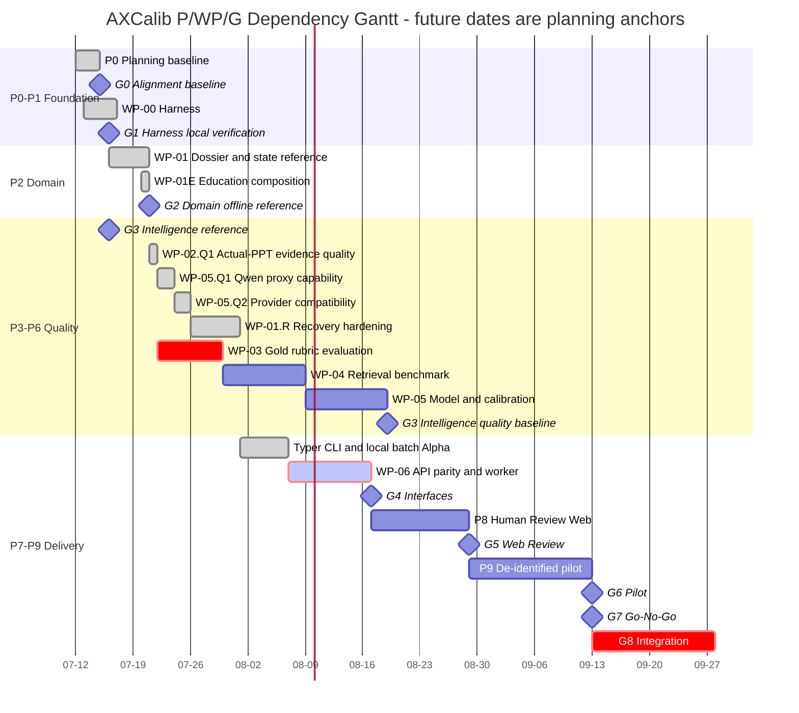

# AXCalib Project Execution Ledger

이 문서는 AXCalib의 **단일 작업 진행 원장**이다. 현재 P(Phase), WP(Work Package), G(Gate),
실행 일정, Active Slice, 검증 결과, 특이사항과 작업 이력을 한곳에서 관리한다. 제품 요구사항은
`WORK_SPEC.md`, 목표와 수용기준은 `GOAL.md`, 기술·UX 설계는 `DESIGN.md`가 계속 기준이며, 이
원장은 그 기준에 따라 **지금 무엇을 하고 있고 무엇이 끝났는지**를 보여 주는 운영 기준정보다.

## 1. 원장 운영 계약

### 1.1 갱신 시점

다음 시점에는 같은 change set에서 이 문서를 반드시 갱신한다.

1. 작업 시작: Active Slice, 범위, 선행조건, 목표 Gate와 예상 Exit Evidence를 기록한다.
2. 작업 중: blocker, 범위변경, 실패, 재시도와 중요한 판단을 `특이사항`에 기록한다.
3. 단계 종료: 실제 변경 파일, 검증 명령·결과, 미검증 범위와 다음 작업을 기록한다.
4. Gate 판정: reference/quality/operational 수준과 승인 주체를 분리해 기록한다.
5. 일정 변경: 변경 이유, 영향받는 WP/Gate와 새 dependency를 기록한다.

### 1.2 편집 규칙

- 2~8절은 현재 상태를 반영하도록 갱신한다.
- 9절 작업 이력은 append-only다. 과거 기록을 조용히 고치지 않고 정정 entry를 추가한다.
- 최신 이력 ID는 frontmatter의 `last_history_id`와 같아야 한다.
- 날짜·담당자·공수가 승인되지 않았으면 `TBD`로 두고 dependency와 Exit Evidence로 계획한다.
- 상세 요구·결정·위험을 이 문서에 복제하지 않고 원문 파일을 링크한다.
- 단계 완료는 코드 완료만 뜻하지 않는다. 문서, diagram, test/eval과 이 원장 갱신까지 포함한다.

### 1.3 상태 표기

| 상태 | 의미 |
|---|---|
| `verified` | 정의된 Exit Evidence가 현재 범위에서 통과함 |
| `offline_reference` | local/synthetic fixture로 실행되지만 운영 품질 완료가 아님 |
| `active` | 현재 구현·검증 중 |
| `ready` | 선행조건을 만족해 다음 작업으로 착수 가능 |
| `planned` | 범위와 dependency는 있으나 미착수 |
| `blocked_policy` | 사람의 정책·데이터·권한 결정이 필요 |
| `not_started` | 아직 계약 또는 구현을 시작하지 않음 |

## 2. 현재 상태 요약

| 항목 | 현재 값 |
|---|---|
| 현재 Phase | **P7 Interfaces**; P2 local Library MVP/Alpha checkpoint 완료 |
| 현재 Work Package | **WP-06 interface hardening** |
| Active Slice | **WP-06.I2b** (`ready`; education principal/role/scope binding contract) |
| 현재 Gate | **G4 Interfaces in progress**; CLI/batch/runtime/project API local Alpha evidence 확보 |
| 다음 Gate | **G4 Interfaces**; education auth, OIDC/immutable upload와 202 worker evidence 필요 |
| 일정 방식 | dependency-only; calendar baseline은 Owner·공수 확정 후 추가 |
| 최근 회귀 | 115 lightweight tests, 10 eval groups, API 12/12, validation 0/0, Ruff check, Pyright 0/0 |
| 현재 경계 | exact on-prem Qwen registration/completion·실제 rubric/gold·Vector DB·full API/OIDC/worker/Web·운영 인증 미완료 |

AXCalib는 실제 제안 PPTX의 등록심의·수행·완료평가 two-gate slice와 교육 프로그램 progression을
Library 호출로 연결했다. 제출 프로젝트의 `completion_accepted`는 교육 milestone 근거가 되지만,
과정 전체는 별도 notification과 관리자 HITL을 통과해야 완료된다. Agent는 어느 Gate에서도 사람의
최종 인증결정을 대신하지 않는다.

## 3. P/WP/G 통합 로드맵

### 3.1 Dependency Gantt

아래 Gantt에서 2026-07-21 이후 날짜와 bar 길이는 **dependency와 상대 작업량을 보여 주는 계획용
anchor**다. 승인된 납기 약속이 아니다. 실제 착수일·완료일은 6절과 작업 이력에 별도로 기록한다.



### 3.2 Phase와 Work Package 매핑

| Phase | 관련 WP/Slice | 현재 상태 | Exit Gate / 남은 핵심 증거 |
|---|---|---|---|
| P0 Planning | baseline 문서·정책 | `offline_reference` | G0 Owner/use-case 공식 sign-off 남음 |
| P1 Harness | WP-00 | `verified` | G1 local validate/test/eval 통과 |
| P2 Domain | WP-01, WP-01E, R1 | `verified_local_alpha` | project/education recovery와 maintenance 완료; producer/distributed transaction 남음 |
| P3 Evidence | WP-02, Q1 | `contract_verified` | 제한형 actual-PPT render/locator/coverage 완료; general VLM 남음 |
| P4 Retrieval | WP-04 | `offline_reference` | labeled corpus와 embedding/Qdrant benchmark |
| P5 Evaluation | WP-03, WP-05.Q1/Q2/05 | `proxy_registration_verified_exact_pending` | JSON-mode 500 복구, Qwen/GPT-4o proxy registration 완료; exact on-prem/approved gold 남음 |
| P6 Calibration | WP-05/06 일부 | `not_started` | panel disagreement와 human agreement report |
| P7 Interfaces | CLI, WP-06 | `active` | CLI/batch/runtime/project API local Alpha 완료; education auth/OIDC/upload/worker 남음 |
| P8 Web Review | Web delivery | `blocked_policy` | FE/RBAC 선택, API, reviewer E2E와 G5 |
| P9 Pilot | pilot package | `not_started` | 승인된 비식별 자료, G6~G7 결정 |

## 4. Gate Control Board

| Gate | 현재 판정 | 통과 증거 | 미완료·승인 필요 |
|---|---|---|---|
| G0 Alignment | `reference_ready` | 제품명·철학·T1·설계 기준 정렬 | Product/Evaluation Owner와 첫 공식 use case |
| G1 Harness | `verified_local` | `prep` 명령, 문서·schema·test/eval 하네스 | 운영 CI 정책은 별도 |
| G2 Domain MVP | `verified_local_alpha` | dossier/snapshot/two-gate, project/education journal, checkpoint, maintenance | producer/database/distributed transaction은 운영 hardening으로 유지 |
| G3 Intelligence | `reference_verified_quality_pending` | Docling, restricted render 16/16, gold locator 13/13, lexical/fake dense, structured evaluator, Qwen Plus/GPT-4o proxy registration | exact Qwen registration/completion, general VLM, official semantic gold, Qdrant/calibration |
| G4 Interfaces | `in_progress` | Typer CLI, sync/async executor, JSONL batch, fail-closed runtime + principal-bound project API/OpenAPI | education auth, OIDC/RBAC, immutable upload와 202 worker/SSE |
| G5 Web Review | `blocked_policy` | UX/architecture 문서만 존재 | FE stack, RBAC, API와 reviewer E2E |
| G6 Pilot | `not_started` | 없음 | 승인된 비식별 paired dataset |
| G7 Go/No-Go | `not_started` | 없음 | Sponsor Continue/Narrow/Stop 결정 |
| G8 Integration | `not_started` | 없음 | 운영 API/SSO/backup/rollback 승인과 인수 |

`reference` 판정은 다음 Gate를 자동 승인하지 않는다. 특히 G3 reference는 실제 모델·검색 품질이나
공식 rubric 품질을 의미하지 않는다.

## 5. Active Slice

### 5.1 종료된 직전 Slice — WP-02.Q1 Actual-PPT Evidence Quality Baseline

| 항목 | 결과 |
|---|---|
| 상태 | `verified_restricted_fixture` |
| 완료일 | 2026-07-21 |
| Module | M03 `contract_verified`; M05 quality reference 보강 |
| 핵심 수치 | render 16/16, gold locator 13/13, field 12/12, criterion 13/13, unsupported 0 |
| 품질 경계 | supplied image-only fixture의 provenance/coverage; general VLM·공식 rubric 품질 아님 |
| 상세 근거 | `docs/evaluation/wp02-actual-ppt-evidence-quality-report.md` |

Exit Evidence:

- [x] 16/16 slide가 local render manifest와 SHA-256을 가진다.
- [x] 13개 reviewed locator가 손실 없이 gold fixture로 round-trip된다.
- [x] 모든 criterion 결과가 해소 가능한 locator 또는 `insufficient_evidence`를 가진다.
- [x] 동일 입력·설정 반복에서 구조적 manifest와 image hash가 재현된다.
- [x] network/GPU/API key 없이 unit/integration/eval이 통과한다.
- [x] `prep validate/test/eval`, Ruff, Pyright 결과를 7절과 9절에 기록했다.
- [x] Mermaid/SVG/module control board와 요구 추적표를 같은 change set에서 갱신했다.

### 5.2 종료된 최신 Slice — WP-05.Q1 Qwen3.5 OpenAI-compatible Capability Validation

| 항목 | 내용 |
|---|---|
| 상태 | `completed_proxy_exact_pending` |
| 목적 | 실제 배포 예정 Qwen3.5-397B-A17B의 endpoint·구조화 출력·vision 계약을 공급자 독립적으로 검증 |
| 대상 Module | model gateway, M05 evaluation, M10 runtime, M11 validation script |
| 입력 | canonical `OPENAI_API_KEY`, `OPENAI_BASE_URL`, `OPENAI_MODEL`; synthetic text/image probe |
| 출력 | secret/raw reasoning 없는 capability report, checkpoint identity 판정, offline contract 회귀 |
| 목표 Gate | G3 Intelligence quality evidence 일부 |
| 외부 호출 | 사용자 승인 범위에서 SkillBoss Qwen3.5 Plus 프록시 소량 호출; exact on-prem endpoint는 미제공 |

Exit Evidence:

- [x] live script가 SkillBoss import 없이 canonical `OPENAI_*` 세 변수만으로 실행된다.
- [x] exact checkpoint와 provider alias를 분리하고 alias를 exact model 검증으로 승격하지 않는다.
- [x] structured text와 synthetic vision 결과를 Pydantic으로 검증한다.
- [x] raw prompt/image/output와 Qwen `reasoning_content`를 report/audit에 보존하지 않는다.
- [x] SkillBoss 프록시 결과와 exact on-prem 미검증 경계를 개발리포트에 기록한다.
- [x] offline fake endpoint, 전체 test/eval/validate, Ruff, Pyright 회귀가 통과한다.

### 5.3 종료된 최신 Slice — WP-01.R1.2 Library MVP / Alpha

| 항목 | 내용 |
|---|---|
| 상태 | `verified_local_library_alpha`; 103 tests/10 eval groups/validate 0/0/Ruff/Pyright 통과 |
| 목적 | 복구 가능한 project/education 상태변경, 명시적 pipeline run, CLI·batch·clean install을 갖춘 제한형 Library MVP/Alpha 완성 |
| 대상 Module | M00 pipeline, M01 dossier, M02 state, M08 audit/notification, M09 education, M10 runtime, M11 CLI |
| 입력 | 현재 filesystem CAS, atomic file write, durable recording outbox와 failure-injection fixture |
| 출력 | education transaction, local maintenance, checkpoint/cancel executor, CLI/batch, wheel·quickstart와 audit evidence |
| 목표 Gate | G2 Domain hardening 종료 후보와 G4 Interfaces 진입 |
| 외부 호출 | 없음; local filesystem/synthetic failure injection만 사용 |

작업 범위:

1. education enrollment/audit와 completion outbox를 append-only journal로 복구한다.
2. stale lock, orphan temp와 journal retention을 삭제 없는 quarantine/archive 정책으로 구현한다.
3. PipelineContext, checkpoint/resume, cancellation과 retryable/terminal 결과를 고정한다.
4. allowlisted pipeline catalog를 사용하는 CLI와 bounded local batch를 구현한다.
5. wheel build, clean `.venv` install과 supplied PPTX quickstart를 검증한다.
6. Library MVP checkpoint를 audit·문서·diagram과 함께 commit/push한 뒤 G4 첫 slice를 시작한다.

Exit Evidence:

- [x] education failure injection 뒤 enrollment/audit/outbox가 중복 알림 없이 일관되게 복구된다.
- [x] stale lock/orphan/journal은 기본 report-only이며 apply도 삭제 대신 quarantine/archive한다.
- [x] PipelineContext와 run checkpoint가 sync/async, cancel, retryable/terminal 상태를 보존한다.
- [x] CLI와 batch가 Library registry를 직접 호출하고 일부 실패·재실행을 숨기지 않는다.
- [x] wheel을 clean environment에 설치하고 실제 PPTX quickstart를 실행한다.
- [x] 전체 lightweight offline test/eval/validate, Ruff, Pyright와 secret scan이 통과한다.
- [x] 새 위험·결정과 module/diagram/PROJECT_STATE 변경을 기록한다.

R1.1 결과:

- `prepared → applying → reconcile_required/reconciling → committed/blocked` append-only hash chain
- create/update dossier CAS와 audit `append_once` 복구
- HITL report JSON/Markdown와 recorded outbox hash prerequisite
- `project.transaction.reconcile@v1alpha1`, working script와 3-boundary synthetic eval
- R1.1 완료 범위를 유지하며 R1.2 결과는
  `docs/evaluation/wp01-r1-2-library-mvp-alpha-report.md`와 HIST-2026-07-22-005에 고정했다.

### 5.4 종료된 최신 Slice — WP-05.Q2 SkillBoss HTTP500 Recovery

| 항목 | 내용 |
|---|---|
| 상태 | `completed_provider_proxy_exact_pending` |
| 목적 | SkillBoss Qwen proxy의 full-rubric HTTP 500 원인을 재현·분리하고 공급자 독립 structured-output 계약으로 복구 |
| 대상 Module | model gateway, M05 evaluation, M10 runtime, M11 validation script |
| 입력 | 비식별 supplied fixture, synthetic 최소 재현 요청, SkillBoss `qwen3.5-plus` proxy |
| 출력 | JSON-mode contract injection, 안전한 wrapped-upstream 진단, 대체 multimodal probe와 개발리포트 |
| 목표 Gate | G3 Intelligence quality evidence 일부 |
| 외부 호출 | 사용자 승인 범위의 소량 live 진단; raw prompt/output/reasoning은 보존하지 않음 |

Exit Evidence:

- [x] SkillBoss CLI `0.1.4`와 공식 skill pack `main`을 갱신하고 설치 해시를 확인한다.
- [x] minimal `json_object` 요청에서 `JSON` 단어 누락이 upstream 400이며 SkillBoss가 HTTP 500으로
  감싸는 원인임을 재현한다.
- [x] `json_object` dialect가 명시적 JSON Schema prompt contract를 자동 포함한다.
- [x] wrapped upstream error에서 message/evidence를 노출하지 않고 status/type/code만 진단한다.
- [x] Qwen/GPT-4o route로 structured text/vision과 registration smoke를 검증하고 GLM vision 실패를 기록한다.
- [x] 전체 offline test/eval/validate, Ruff, Pyright 회귀와 단계 리포트를 남긴다.

### 5.5 완료 Slice — WP-06.I1 Minimal API Parity

| 항목 | 내용 |
|---|---|
| 상태 | `verified_local_alpha`; Library MVP/Alpha checkpoint `a03a633` push 후 2026-07-22 완료 |
| 목적 | committed OpenAPI 3.1과 실제 HTTP handler가 같은 Library registry/run checkpoint를 호출하게 함 |
| 대상 Module | M10 runtime, M12 API/worker; M00/M11 의미 재사용 |
| 입력 | typed pipeline request, run context, bearer auth contract, existing OpenAPI artifact |
| 출력 | minimal FastAPI app factory, pipeline catalog/run/status/cancel endpoint와 contract test |
| 목표 Gate | G4 Interfaces |
| 외부 호출 | 없음; in-process synthetic TestClient만 사용, 배포·계정 생성 없음 |

Exit Evidence:

- [x] FastAPI는 optional `api` extra이고 Core/Domain module이 이를 import하지 않는다.
- [x] OpenAPI 3.1 artifact와 실제 route/request/response 의미가 일치한다.
- [x] handler는 script subprocess나 domain 로직 복제 없이 `AXCalib` registry/executor를 호출한다.
- [x] unknown pipeline/option, auth failure, run conflict와 result status가 구조적으로 구분된다.
- [x] in-process contract/E2E, Ruff, Pyright, validate/test/eval과 문서/diagram drift 검증이 통과한다.

### 5.6 완료 Slice — WP-06.I2a Principal-bound Project and Artifact Contract

| 항목 | 내용 |
|---|---|
| 상태 | `verified_local_contract`; WP-06.I1 commit `67a387e` push 이후 2026-07-22 완료 |
| 목적 | project 생성·HITL command를 인증 principal에 bind하고 remote local-path 입력을 제거 |
| 대상 Module | M02 state/approval, M09 workflow, M12 API/worker |
| 입력 | project role/scope mapping, staged artifact reference, registration/completion decision command |
| 출력 | principal-bound project endpoint, staged artifact resolver/hash contract와 authorization test |
| 목표 Gate | G4 Interfaces |
| 외부 호출 | 없음; synthetic/in-process only, 실제 OIDC·계정·배포 없음 |

Exit Evidence:

- [x] project owner/administrator command가 request actor 문자열을 신뢰하지 않고 principal에 bind된다.
- [x] project/organization scope mismatch가 domain mutation 전에 거부된다.
- [x] local filesystem path를 remote request에서 직접 받지 않는 staging/content-hash 계약이 있다.
- [x] target OpenAPI 중 구현한 resource만 implemented artifact로 승격한다.
- [x] threat model, contract/E2E, validate/test/eval와 diagram/module drift 검증이 통과한다.
- [x] education learner/mentor/instructor binding은 후속 WP-06.I2b로 범위와 선행조건이 기록된다.

### 5.7 현재 Active Slice — WP-06.I2b Education Principal Binding Contract

| 항목 | 내용 |
|---|---|
| 상태 | `ready`; WP-06.I2a checkpoint push 후 착수 가능 |
| 목적 | education command의 learner/mentor/instructor/administrator를 enrollment/program/project context에 bind |
| 대상 Module | M02 state/approval, M09 education workflow, M12 API/worker |
| 입력 | approved role vocabulary, program/enrollment scope matrix, immutable program version과 current project API principal contract |
| 출력 | principal-bound education typed command endpoint와 authorization regression |
| 목표 Gate | G4 Interfaces |
| 외부 호출 | 없음; synthetic/in-process로 시작, 실제 OIDC·계정·배포 없음 |

Exit Evidence:

- [ ] request actor 문자열 없이 verified principal이 education audit actor가 된다.
- [ ] learner/mentor/instructor/administrator command별 role·scope matrix가 명시된다.
- [ ] program version, enrollment learner, mentor, organization mismatch가 mutation 전에 거부된다.
- [ ] project completion 근거 연결은 기존 dossier context/state guard를 우회하지 않는다.
- [ ] implemented education resource만 runtime OpenAPI에 추가하고 contract/E2E가 통과한다.
- [ ] approved OIDC claim mapping과 실제 계정/배포는 별도 운영 Gate로 유지한다.

## 6. 일정·작업 Queue

calendar 일정은 담당자·공수·승인일이 정해진 뒤 baseline으로 고정한다. 그 전에는 아래 dependency
순서와 Exit Evidence를 일정 기준으로 사용한다.

| 순서 | Phase / WP | Slice | 상태 | 선행조건 | 실제 착수 | 목표/완료 | 다음 Gate |
|---:|---|---|---|---|---|---|---|
| 1 | P3 / WP-02 | Q1 Actual-PPT evidence quality | `verified` | Docling contract, supplied fixture | 2026-07-21 | 2026-07-21 | G3 quality evidence 일부 |
| 2 | P5 / WP-05 | Q1 Qwen provider-proxy capability | `partial_verified` | Q1 evidence, user-approved SkillBoss access | 2026-07-21 | 2026-07-21 | G3 evidence 일부 |
| 3 | P5 / WP-05 | Q2 SkillBoss HTTP500 recovery | `verified_proxy` | Q1 proxy evidence, user-approved live diagnostics | 2026-07-22 | 2026-07-22 | G3 evidence 일부 |
| 4 | P2 / WP-01 | R1.1/R1.2 Library MVP recovery | `verified_local_alpha` | Q2 provider compatibility, filesystem boundary | 2026-07-22 | 2026-07-22 | G2 local Alpha |
| 5 | P5 / WP-03 | Q2 rubric/report gold benchmark | `planned` | Q1 gold evidence, Owner rubric | TBD | TBD | G3 quality |
| 6 | P7 / CLI | project/education/runtime pipeline parity | `verified_alpha` | WP-01.R, stable pipeline result | 2026-07-22 | 2026-07-22 | G4 evidence 일부 |
| 7 | P4 / WP-04 | embedding/Qdrant/rerank benchmark | `blocked_policy` | approved corpus와 labels | TBD | TBD | G3 quality |
| 8 | P5-P6 / WP-05 | exact on-prem Qwen/panel/calibration | `blocked_endpoint_policy` | exact endpoint·gold label 승인 | TBD | TBD | G3 quality |
| 9 | P7 / WP-06 | minimal API/OpenAPI parity | `verified_local_alpha` | CLI/batch Alpha와 auth contract | 2026-07-22 | 2026-07-22 | G4 evidence 일부 |
| 10 | P7 / WP-06 | principal-bound project command/artifact contract | `verified_local_contract` | runtime API Alpha, role/scope policy | 2026-07-22 | 2026-07-22 | G4 evidence 일부 |
| 11 | P7 / WP-06 | education principal binding contract | `ready` | project API contract, education domain reference | TBD | TBD | G4 |
| 12 | P8-P9 | Web/Pilot | `blocked_policy` | G4, FE/RBAC/data 승인 | TBD | TBD | G5-G7 |

## 7. 최근 검증 증거

| 날짜 | 범위 | 명령/증거 | 결과 | 품질 주장 경계 |
|---|---|---|---|---|
| 2026-07-22 | WP-06.I2a principal-bound project API | project/runtime API contract, full test/eval, Ruff, Pyright, validate, SVG/PNG visual audit | API 12/12, full 115 passed, 10 eval groups, Ruff check, Pyright 0/0, validate 0/0 | in-process project command/staging port; actual OIDC/upload/server 미포함 |
| 2026-07-22 | WP-06.I1 runtime API Alpha | contract pytest, clean core/API wheel, full test/eval, Ruff/Pyright/validate | API 7/7, full 110 passed, 10 eval groups, 0/0 static/validate | in-process sync API; OIDC/RBAC/upload/worker/server 미포함 |
| 2026-07-22 | WP-01.R1.2 Library MVP/Alpha | lightweight `prep test/eval`, Ruff, low-memory Pyright, validate, clean wheel/CLI/actual-PPTX | 103 passed, 10 eval groups, Alpha 8/8, Ruff, Pyright 0/0, validate 0/0 | single-host offline Alpha; Docling current-turn rerun·API/RBAC/운영 미포함 |
| 2026-07-22 | WP-01.R1.1 project transaction recovery | 3-boundary crash eval, full test/eval, Ruff/Pyright | 88 passed, 9 eval groups, recovery 3/3, Ruff passed, Pyright 0/0 | local project dossier/audit only; broader recovery pending |
| 2026-07-22 | WP-05.Q2 단계 종료 offline 회귀 | `prep test`, `prep eval`, Ruff, Pyright | 79 passed, 8 eval groups, Ruff passed, Pyright 0/0 | fake/offline contract; live quality 아님 |
| 2026-07-22 | Qwen Plus generic proxy probe | structured text + synthetic vision | passed, 12,415/10,415ms; deployment false | alias capability만 |
| 2026-07-22 | Qwen Plus registration recovery | supplied fixture, JSON-object schema contract | 7 criteria, model 77,724ms, notification 1, HITL pending | exact Qwen/공식 심의 아님 |
| 2026-07-22 | GPT-4o alternate comparison | text/vision + supplied registration | 2,650/2,460ms; registration model 7,121ms, HITL pending | alternate provider proxy만 |
| 2026-07-22 | GLM 4.5V comparison | generic proxy probe | text 5,688ms passed; vision gateway error | multimodal fallback으로 미승격 |
| 2026-07-22 | WP-05.Q2 최소 재현 | 248-byte synthetic `json_object` without `JSON` keyword | upstream 400 `invalid_parameter_error`가 SkillBoss HTTP 500으로 wrapping됨 | provider proxy 오류 매핑 원인만 확인 |
| 2026-07-22 | WP-05.Q2 대조군 | simple, 1 criterion, 7 criteria/13 slides, actual-content ACK | 모두 HTTP 200; 명시적 `JSON`을 넣은 actual 1 criterion도 HTTP 200 | output schema 품질은 별도 |
| 2026-07-21 | WP-05.Q1 SkillBoss proxy capability | canonical env live probe | structured text/vision passed; response `qwen3.5-plus`; exact identity false | provider proxy transport/capability만 |
| 2026-07-21 | supplied fixture Qwen proxy registration | `json_schema`, `json_object`, output 8192 세 시도 | 모두 HTTP 500, HITL/final 전이 없음 | SkillBoss full-rubric 실패; exact on-prem 결과 아님 |
| 2026-07-21 | WP-05.Q1 단계 종료 offline 회귀 | `prep test`, `prep eval` | 76 passed, 8 eval groups passed | fake exact endpoint와 contract; live model 품질 아님 |
| 2026-07-21 | WP-05.Q1 정적·workspace contract | `prep validate`, Ruff, Pyright | 0 errors/0 warnings | local schema·문서·typing 계약 |
| 2026-07-21 | WP-02.Q1 actual-PPT render/gold | `evals/evidence_quality.py` | 16/16 render, locator 13/13, field 12/12, criterion 13/13, unsupported 0 | 해당 image-only fixture provenance/coverage |
| 2026-07-21 | WP-02.Q1 optional Docling 결합 | `evals/evidence_quality.py --with-docling` | passed; Docling 2.113.0, 16 page/0 text | VLM/semantic 품질 아님 |
| 2026-07-21 | 단계 종료 전체 offline 회귀 | `prep.ps1 test`, `prep.ps1 eval` | 66 passed, 7 eval groups passed | live model/Vector DB/공식 rubric 품질 아님 |
| 2026-07-21 | 정적·workspace contract | `prep validate`, Ruff, Pyright, `git diff --check` | 0 errors/0 warnings; diff whitespace error 없음 | CRLF 안내만 발생 |
| 2026-07-21 | 프로젝트 `.venv` Docling | `uv sync --locked --extra docling --dev` | Docling 2.113.0 설치 | 환경 설치 확인 |
| 2026-07-21 | 실제 PPTX Docling 계약 | `pytest tests/contract/test_docling_adapter.py` | 1 passed; 16 slides, 0 text | 시각 의미 이해 아님 |
| 2026-07-21 | 전체 offline 회귀 | ledger contract를 포함한 `prep.ps1 test` | 60 passed | live model/Vector DB 품질 아님 |
| 2026-07-21 | 전체 offline eval | `prep.ps1 eval` | 6 eval groups passed | synthetic/reference contract만 주장 |
| 2026-07-21 | workspace contract | `prep.ps1 validate` | 0 errors, 0 warnings | local 문서·schema·보안 계약 |
| 2026-07-20 | education lifecycle eval | `prep.ps1 eval` | project/program HITL와 synthetic quality contract 통과 | 공식 교육 인증 아님 |

## 8. 특이사항·Blocker·범위 경계

1. 제공 PPTX는 16장 image-only다. Docling은 구조를 성공적으로 읽지만 text는 0자이므로
   sidecar 또는 향후 승인된 VLM 근거 없이는 시각 의미를 추론하지 않는다. 제한형 renderer는
   pixel provenance를 고정할 뿐 semantic extraction을 수행하지 않는다.
2. Windows 전역 Pytest 임시 link 정리의 `WinError 5`가 반복됐다. assertion 실패와 분리했고
   `prep test`가 실행별 `output/pytest-runs/run-{pid}`를 쓰도록 보강했다. 이어 atomic replace에서
   일시적 lock 1건이 재현돼 bounded retry를 추가한 뒤 76 tests가 통과했다.
3. 2026-07-20 교육 composition과 R1.1 project recovery는 commit `ebd74ed`, R1.2 Library Alpha는
   commit `a03a633`까지 `origin/main`에 반영됐다. WP-06.I1은 현재 change set 검증 후 별도
   checkpoint commit/push한다.
4. SkillBoss catalog에는 exact `Qwen3.5-397B-A17B`가 없고 `qwen3.5-plus`만 있다. 기존 full
   registration HTTP 500의 직접 원인은 `json_object` 메시지에 literal `JSON`이 없던 AXCalib 요청과
   upstream 400을 500으로 감싼 proxy mapping 조합으로 확인됐다. exact on-prem 검증은 여전히 필수다.
5. Product/Evaluation/Course Owner, 실제 rubric·threshold, actual completion template, labeled corpus,
   on-prem endpoint, program rollout/credential 정책이 아직 확정되지 않았다.
6. 실제 데이터 반입, 추가 live model, Vector DB 운영, API/Web 배포, 계정·권한 생성은 승인 전
   진행하지 않는다.
7. Gantt 미래 bar는 calendar 약속이 아니다. Owner, 담당자, 공수와 목표일이 정해지면 변경 이력과
   함께 calendar baseline을 추가한다.
8. maintenance test가 traceback 없이 종료된 직접 원인은 Windows의 `os.kill(pid, 0)` self-termination
   이었다. read-only Win32 process query로 교체해 회귀를 통과했다. 당시 가용 메모리 408~833 MiB는
   2차 위험이므로 Docling contract를 기본 test에서 분리하고 검증을 순차 실행한다.
9. WP-06.I1 첫 `uv sync`는 이전 불완전 설치의 read-only dist-info 때문에 access denied가 났다.
   실행 중 Python process가 없음을 확인하고 `.venv` 내부 metadata attribute만 복구한 뒤 sync와
   `RECORD`/import를 재검증했다. 소스·dossier·실제 데이터는 변경하지 않았다.
10. 첫 G4 전체 test의 2개 실패는 아직 생성 전이던 개발리포트 link validation뿐이었고 나머지
    108개는 통과했다. 리포트를 추가한 최종 재실행은 110/110 통과했다. Docling/live model/socket
    server는 이번 slice에서 호출하지 않았다.

## 9. 작업 이력

### HIST-2026-07-13-001

- Phase / WP / Gate: P0 Planning / baseline specification / G0 preparation
- 상태: `completed_reference`
- 작업: AXCalib 명칭, library-first 원칙, dossier와 두 단계 심의, on-prem/Vector DB 확장계획을
  WORK_SPEC·GOAL·DESIGN에 고정했다.
- 검증: 초기 문서·링크·용어 baseline 확인.
- 특이사항: 이 시점은 planning 중심이며 실제 제품 구현 완료가 아니었다.
- 관련 근거: Git commit `9207047`.

### HIST-2026-07-15-001

- Phase / WP / Gate: P1 Harness / WP-00 / G1
- 상태: `completed_local`
- 작업: `prep.ps1`, src/apps/docs/fixtures/tests/evals 구조, workflow diagram, module control board와
  architecture deck을 구축했다.
- 검증: pre-development validate/test/eval과 문서 링크·시각자료 검사.
- 특이사항: 실제 rubric·model·retrieval 품질은 NO-GO로 유지했다.
- 관련 근거: Git commit `4193727`.

### HIST-2026-07-16-001

- Phase / WP / Gate: P2-P5 reference / WP-01~05 일부 / G2-G3 reference
- 상태: `reference_verified`
- 작업: supplied PPTX two-gate, hash-bound policy, optional Docling manifest, lexical retrieval,
  structured evaluator/report와 관리자 HITL을 연결했다.
- 검증: local/synthetic test/eval과 승인된 비식별 live registration smoke.
- 특이사항: G3 reference이며 실제 Qwen/embedding/Qdrant/gold 품질 완료가 아니다.
- 관련 근거: Git commits `567588c`, `87636c3`, `32e0bc5`와
  [G3 개발리포트](docs/evaluation/g3-intelligence-development-report.md).

### HIST-2026-07-20-001

- Phase / WP / Gate: P2 Domain / WP-01, WP-01E / G2 hardening reference
- 상태: `offline_reference_verified`
- 작업: immutable EducationProgram, revisioned Enrollment, project milestone roll-up, program
  completion HITL, dossier schema migration, filesystem CAS, idempotency와 durable recording outbox를
  구현했다.
- 검증: 당시 58 passed, optional Docling 1 skipped; education/project/retrieval/model config eval 통과.
- 특이사항: 변경은 현재 working tree에 있으며 운영 transaction/RBAC/credential은 미완료다.
- 관련 근거: [교육/WP-01 개발리포트](docs/evaluation/education-program-wp01-development-report.md).

### HIST-2026-07-21-001

- Phase / WP / Gate: P3 preparation / WP-02 prerequisite / G3 quality preparation
- 상태: `verified_local_environment`
- 작업: project `.venv`에 locked Docling optional extra를 설치하고 supplied PPTX adapter 계약을
  실제로 실행했다.
- 검증: Docling 2.113.0, contract 1 passed, 전체 59 passed, validate 0 errors/0 warnings.
- 특이사항: PPTX 16장은 정상 인식됐으나 image-only여서 추출 text는 0자다. 전역 temp cleanup
  권한 오류는 unique workspace `--basetemp` 재실행으로 검증 경로를 분리했다.
- 관련 근거: `tests/contract/test_docling_adapter.py`.

### HIST-2026-07-21-002

- Phase / WP / Gate: P1 Harness governance / WP-00 ledger control / all Gates
- 상태: `completed`
- 작업: `PROJECT_STATE.md`를 P/WP/G Gantt, Active Slice, 일정 Queue, 검증, 특이사항과 append-only
  이력을 가진 단일 Project Execution Ledger로 승격했다.
- 변경 파일: `PROJECT_STATE.md`, `AGENTS.md`, `README.md`, `WORK_SPEC.md`, `GOAL.md`, `DESIGN.md`,
  `DECISIONS.md`, architecture README/blueprint/module plan, `harness/prep.py`, harness contract test.
- 검증: `prep validate` 0 errors/0 warnings, `prep test` 60 passed, 6 eval groups passed, Ruff all
  checks passed, Pyright 0 errors/0 warnings.
- 특이사항: calendar 일정은 아직 약속하지 않고 dependency-only로 유지한다.
- 미검증: Mermaid Gantt의 별도 SVG/browser render는 이번 change에서 실행하지 않았다.
- 다음 작업: Active Slice `WP-02.Q1 actual-ppt-evidence-quality-baseline`.
- 관련 근거: D-030과 작업 하네스 원장 validation contract.

### HIST-2026-07-21-003

- Phase / WP / Gate: P3 Evidence / WP-02.Q1 / G3 Intelligence quality preparation
- 상태: `active`
- 작업: Actual-PPT Evidence Quality Baseline 구현을 시작했다. 16장 중 13장은 전체 화면 embedded
  PNG, 3장은 blank slide임을 확인해 제한형 deterministic renderer와 gold locator/quality eval을
  첫 slice로 고정했다.
- 변경 파일: `PROJECT_STATE.md` Active Slice와 실제 착수일.
- 검증: source SHA-256과 sidecar 13개 annotation, PowerPoint 설치·LibreOffice 미설치,
  13 embedded image/3 blank 구조 확인.
- 특이사항: Microsoft PowerPoint COM은 존재하지만 cross-platform Core 회귀에 사용하지 않는다.
- 미검증: renderer·gold fixture·품질지표 구현과 전체 회귀는 진행 중이다.
- 다음 작업: M03 embedded-image renderer port와 manifest schema 구현.
- 관련 근거: Active Slice Exit Evidence.

### HIST-2026-07-21-004

- Phase / WP / Gate: P3 Evidence / WP-02.Q1 / G3 Intelligence quality evidence portion
- 상태: `completed_restricted_fixture`
- 작업: restricted `SlideRenderer`, deterministic 16-slide manifest, 13 reviewed locator gold fixture,
  evidence-quality report와 optional Docling 결합 eval을 구현했다. M03은 supplied image-only fixture
  범위에서 `contract_verified`로 승격했다.
- 변경 파일: `src/axcalib/ingest/slide_render.py`, `evaluation/evidence_quality.py`, ingest/evaluation
  exports, gold dataset, quality eval, 2개 unit test, harness, ADR-015, WORK_SPEC/GOAL/DESIGN/README,
  workflow blueprint, module board, SVG, 개발리포트와 이 원장.
- 검증: `prep validate` 0 errors/0 warnings, `prep test` 66 passed, `prep eval` 7 groups passed,
  optional Docling quality eval passed(16 page/0 text), Ruff all checks passed, Pyright 0 errors/0
  warnings, `git diff --check` whitespace error 없음.
- 특이사항: 첫 전체 test에서 원장 테스트가 과거 history ID를 하드코딩해 1건 실패했다. 현재 ID를
  regex로 찾아 변조하도록 수정한 뒤 66/66을 재실행했다. external model, GPU, embedding/Vector DB는
  사용하지 않았다.
- 미검증: general PowerPoint rendering fidelity, OCR/VLM semantic accuracy, 다른 actual template,
  공식 rubric/label과 운영 parser sandbox.
- 다음 작업: `WP-01.R1 transaction-journal-reconciliation`을 ready 상태로 전환한다.
- 관련 근거: [WP-02.Q1 개발·코드리뷰 리포트](docs/evaluation/wp02-actual-ppt-evidence-quality-report.md),
  ADR-015, M03 Module Control Board.

### HIST-2026-07-21-005

- Phase / WP / Gate: P5 Evaluation / WP-05.Q1 / G3 Intelligence quality preparation
- 상태: `active`
- 작업: 실제 배포 예정 `Qwen3.5-397B-A17B`를 위한 provider-independent OpenAI-compatible
  capability validation slice를 시작했다. SkillBoss 동적 카탈로그에서 exact ID는 찾지 못했고
  `bailian/qwen3.5-plus`만 별도 provider alias로 확인했다.
- 변경 파일: `PROJECT_STATE.md` Active Slice, dependency Gantt와 작업 Queue 우선순위.
- 검증: SkillBoss `--no-fallback` 고정 JSON smoke 1회 성공; 응답 model은 `qwen3.5-plus`였으며
  exact 397B-A17B checkpoint identity는 확인되지 않았다.
- 특이사항: SkillBoss는 개인환경의 사전 검증 경로일 뿐 제품·on-prem dependency가 아니다.
  응답의 `reasoning_content`는 숨은 추론이므로 AXCalib 산출물에 보존하지 않는다.
- 미검증: exact on-prem endpoint, structured schema dialect, vision, latency·quality benchmark.
- 다음 작업: canonical `OPENAI_API_KEY`/`OPENAI_BASE_URL`/`OPENAI_MODEL` live probe와 offline
  fake-endpoint 회귀를 구현하고 SkillBoss proxy로 text/vision 계약을 실행한다.
- 관련 근거: Active Slice Exit Evidence와 후속 Qwen capability validation report.

### HIST-2026-07-21-006

- Phase / WP / Gate: P5 Evaluation / WP-05.Q1 / G3 Intelligence quality evidence portion
- 상태: `partial_proxy_verified_exact_pending`
- 작업: provider-independent Qwen capability module과 canonical-env live script를 구현했다.
  provider proxy/deployment scope, response model identity, structured text/vision, explicit
  `json_schema`/`json_object`, output token limit와 hidden-reasoning discard를 계약으로 고정했다.
- 변경 파일: `src/axcalib/models/capability.py`, `models/openai_compatible.py`,
  `evaluation/model.py`, `schemas/domain.py`, runtime config/schema와 expert TOML, Qwen script/eval,
  unit/integration tests, ADR-018, 개발리포트, WORK_SPEC/GOAL/DESIGN/README, workflow Mermaid/SVG,
  module board, decision/risk, bounded atomic-replace retry와 이 원장.
- 검증: SkillBoss `qwen3.5-plus` proxy structured text/vision passed(20,628/9,436 ms), exact identity
  false/deployment-ready false. fake exact endpoint E2E와 전체 `prep test` 76 passed, `prep eval` 8
  groups passed, `prep validate` 0 errors/0 warnings, Ruff passed, Pyright 0 errors/0 warnings.
- 특이사항: supplied fixture의 full registration payload는 `json_schema`, `json_object`, output limit
  8192에서 모두 SkillBoss HTTP 500으로 fail-closed됐다. request는 5.3KB 이하였고 짧은 한국어
  request는 성공했으므로 원인을 추측해 성공 처리하지 않았다. model failure safe audit event 부재를
  R-032로 등록했다. 반복된 Windows global pytest temp 권한 오류는 `prep test` workspace basetemp로
  하네스에서 제거했다.
- 미검증: exact on-prem `Qwen3.5-397B-A17B`, full registration/completion rubric, slide pixel을 쓰는
  VLM 평가, task quality·hallucination·agreement·latency/cost benchmark와 serving fingerprint.
- 다음 작업: current Active Slice `WP-01.R1 transaction-journal-reconciliation`; exact endpoint 제공 시
  WP-05 deployment probe와 full two-gate quality를 재개한다.
- 관련 근거: [Qwen3.5 capability 검증 리포트](docs/evaluation/qwen35-capability-validation-report.md),
  ADR-018, D-031, R-031/R-032, M05/M10/M11 Module Control Board.

### HIST-2026-07-22-001

- Phase / WP / Gate: P5 Evaluation / WP-05.Q2 / G3 Intelligence quality preparation
- 상태: `active`
- 작업: SkillBoss CLI와 skill pack을 최신 공식 배포본으로 갱신하고, full-rubric HTTP 500을
  synthetic/비식별 대조군으로 분리했다. 248-byte 최소 요청에서도 `json_object` 메시지에 literal
  `JSON`이 없으면 upstream 400 `invalid_parameter_error`가 SkillBoss HTTP 500으로 wrapping됨을
  확인했다. 같은 요청에 `JSON`을 명시하면 HTTP 200으로 전환됐다.
- 변경 파일: 외부 SkillBoss CLI/skill pack 설치, `PROJECT_STATE.md` Active Slice와 실행 증거.
- 검증: simple 문자열, 1 criterion, 7 criteria/13 synthetic slides, actual fixture content ACK는 200;
  기존 full registration과 JSON keyword 없는 최소 요청은 500; explicit JSON actual 1 criterion은
  transport 200 뒤 잘못된 field name 때문에 Pydantic이 fail-closed했다.
- 특이사항: SkillBoss 응답의 update warning은 client version header가 없어 `current: unknown`으로
  계속 표시된다. 공식 repository 최신 package는 설치됐지만 안내된 `install/update.sh`는 repository에
  존재하지 않는다. raw prompt/output/reasoning은 보존하지 않았다.
- 미검증: JSON Schema prompt contract 적용 후 full registration, 대체 multimodal route와 전체 회귀.
- 다음 작업: gateway-level JSON contract injection과 wrapped-upstream safe diagnostic을 구현하고 live
  registration 및 alternate multimodal capability를 재검증한다.
- 관련 근거: 5.4 Active Slice와 후속 WP-05.Q2 개발리포트.

### HIST-2026-07-22-002

- Phase / WP / Gate: P5 Evaluation / WP-05.Q2 / G3 Intelligence quality evidence portion
- 상태: `completed_provider_proxy_exact_pending`
- 작업: `json_object` mode에 literal JSON/canonical schema contract를 주입하고 wrapped upstream
  status/type/code safe diagnostic을 구현했다. Qwen-specific probe를 공통 multimodal probe로 확장하고
  provider scope가 deployment-ready로 승격되지 않게 고정했다.
- 변경 파일: `src/axcalib/models/openai_compatible.py`, `models/capability.py`, generic probe script,
  model gateway/capability/script tests와 eval, ADR-019, WP-05.Q2 개발리포트, README/WORK_SPEC/GOAL/
  DESIGN/manual/readiness, Mermaid/SVG/module board, decision/risk와 이 원장.
- 검증: Qwen Plus generic text/vision 12,415/10,415ms, supplied registration 7 criteria/model 77,724ms,
  notification 1/HITL pending. GPT-4o text/vision 2,650/2,460ms와 registration model 7,121ms 통과.
  GLM 4.5V text 5,688ms 통과·vision gateway error로 fail-closed. 전체 `prep test` 79 passed,
  `prep eval` 8 groups passed, `prep validate` 0 errors/0 warnings, Ruff passed, Pyright 0/0.
- 특이사항: SkillBoss CLI package는 0.1.4지만 `--version`은 0.1.0을 표시한다. 최신 skill repository에도
  안내된 update script가 없고 version header 부재로 server warning은 current unknown을 유지한다.
  raw prompt/image/output/reasoning과 secret은 repository report에 저장하지 않았다.
- 미검증: exact on-prem `Qwen3.5-397B-A17B`, live completion, approved rubric/gold/human agreement,
  model failure audit event와 provider-side updater/status mapping 수정.
- 다음 작업: current Active Slice `WP-01.R1 transaction-journal-reconciliation`; exact endpoint 제공 시
  deployment scope와 registration/completion quality를 재검증한다.
- 관련 근거: [WP-05.Q2 복구 리포트](docs/evaluation/wp05-q2-skillboss-http500-recovery-report.md),
  ADR-019, D-032, R-031/R-033/R-034, M05/M10/M11 Module Control Board.

### HIST-2026-07-22-003

- Phase / WP / Gate: project handoff checkpoint / current P2-WP-01.R1-G2 unchanged
- 상태: `completed_documentation_checkpoint`
- 작업: 누적 개발분을 사용자 관점 `CHANGELOG.md`, 쉬운 용어의 `docs/HANDOFF.md`, 재개용
  `.memory-bank/README.md`로 정리했다. 실행상태와 작업 이력의 단일 기준은 이 원장으로 유지했다.
- 변경 파일: `CHANGELOG.md`, `docs/HANDOFF.md`, `.memory-bank/README.md`, `README.md`, 이 원장.
- 검증: 문서 link와 harness contract를 `prep validate`로 확인한다. 누적 code baseline은 직전 단계의
  79 tests, 8 eval groups, Ruff passed, Pyright 0/0 결과를 유지한다.
- 특이사항: memory bank는 비권위 요약 캐시이며 요구사항·상태를 별도로 복제해 결정하지 않는다.
- 미검증: exact on-prem Qwen, 공식 rubric/gold, 운영 notification/RBAC/API/Web은 그대로 남는다.
- 다음 작업: Active Slice `WP-01.R1 transaction-journal-reconciliation`을 착수한다.
- 관련 근거: [CHANGELOG](CHANGELOG.md), [인수인계 안내](docs/HANDOFF.md),
  [Memory Bank](.memory-bank/README.md).

### HIST-2026-07-22-004

- Phase / WP / Gate: P2 / WP-01.R1.1 / G2 Domain hardening
- 상태: `project_dossier_audit_verified_broader_recovery_pending`
- 작업: project create/update에 revision/hash-bound transaction plan과 append-only JSONL hash chain을
  적용했다. dossier CAS와 audit append-once를 재개 가능하게 만들고, HITL report/recorded outbox를
  hash prerequisite로 고정했다. allowlisted reconcile pipeline, facade, script와 synthetic eval을 추가했다.
- 변경 파일: `runtime/transactions.py`, `pipelines/recovery.py`, project service/client/audit, recovery
  script·unit/integration/eval, ADR-020, 개발리포트, WORK_SPEC/GOAL/DESIGN/README/CHANGELOG/HANDOFF,
  module board·Mermaid/SVG, decision/risk와 이 원장.
- 검증: targeted 9 passed, full 88 passed, 9 eval groups passed, crash boundary 3/3, Ruff passed,
  Pyright 0 errors/0 warnings, `prep validate` 0 errors/0 warnings.
- 특이사항: Windows global pytest temp cleanup 권한 오류가 한 번 발생했으나 작업공간 고유
  `--basetemp` 재실행에서 7/7 통과했다. 외부 모델·실데이터·notification 전송은 사용하지 않았다.
- 미검증: education enrollment/audit/outbox, report/outbox producer 자체, stale-lock/orphan cleanup,
  database/distributed worker transaction과 운영 provider.
- 다음 작업: WP-01.R1.2 broader recovery와 stale-lock quarantine/retention을 구현한다.
- 관련 근거: [ADR-020](docs/adr/ADR-020-local-project-transaction-journal.md),
  [WP-01.R1.1 리포트](docs/evaluation/wp01-r1-transaction-recovery-report.md), D-033,
  R-012/R-029/R-035와 M01/M02/M08/M10 Module Control Board.

### HIST-2026-07-22-005

- Phase / WP / Gate: P2→P7 / WP-01.R1.2 + CLI Alpha / G2 local Alpha→G4 entry
- 상태: `verified_local_library_alpha_g4_ready`
- 작업: PipelineContext와 typed registry에 request/context/result hash checkpoint, per-run lease,
  sync/async, cooperative cancel과 terminal/retryable replay를 고정했다. education enrollment/audit
  transaction reconcile, report-only 기본 workspace maintenance, strict JSONL batch와 Typer/Rich Alpha
  CLI를 같은 Library registry에 연결했다. optional Docling contract는 저메모리 기본 test와 분리했다.
- 변경 파일: `src/axcalib/pipelines`, `runtime/execution.py`, `batch.py`,
  `enrollment_transactions.py`, `maintenance.py`, education service/client, `src/axcalib/cli`, pyproject/lock,
  unit/integration/eval, actual-PPTX quickstart, ADR-021, 개발리포트, README/CHANGELOG/GOAL/WORK_SPEC/DESIGN,
  module plan·Mermaid·SVG, decision/risk와 이 원장.
- 검증: targeted pipeline 11, education 2, maintenance 1, CLI 2 passed; full lightweight offline 103
  passed; 10 eval groups와 Alpha 8/8 checks; Ruff passed; low-memory Pyright 0 errors/0 warnings;
  `prep validate` 0 errors/0 warnings. clean wheel `[cli]` 설치, installed CLI 8개 pipeline catalog와 actual
  PPTX revision 3 / `registration_hitl_pending` / `waiting_human` quickstart를 확인했다.
- 특이사항: Windows `os.kill(pid, 0)`가 pytest 자기 process를 종료한 직접 원인을 non-mutating Win32
  query로 수정했다. 당시 free memory 408~833 MiB는 2차 위험이었다. Docling은 이 실패에 적재되지
  않았고 이번 단계에서는 별도 재실행하지 않았다; 기존 16-page/0-text 증거를 유지한다.
- 미검증: report/outbox producer 자체, database/distributed worker lease, exact on-prem Qwen full
  two-gate, official rubric/human gold, Vector DB, 운영 notification/RBAC/API/Web.
- 다음 작업: checkpoint commit/push 후 Active Slice `WP-06.I1 minimal-api-parity`를 시작한다.
- 관련 근거: [ADR-021](docs/adr/ADR-021-local-pipeline-execution-and-alpha-cli.md),
  [WP-01.R1.2 리포트](docs/evaluation/wp01-r1-2-library-mvp-alpha-report.md), D-034,
  R-006/R-010/R-012/R-029/R-036/R-037와 M00/M01/M02/M08/M10/M11 Module Control Board.

### HIST-2026-07-22-006

- Phase / WP / Gate: P7 / WP-06.I1 / G4 Interfaces
- 상태: `verified_local_runtime_api_alpha_g4_remaining`
- 작업: optional FastAPI app factory가 같은 Library registry/executor를 호출하도록 pipeline
  catalog, synchronous run, hash-verified status와 cooperative cancel route를 구현했다. injected bearer
  verifier와 exact delivery grant는 기본 fail closed이며 generic actor/admin decision field, cross-run
  access, idempotency/revision conflict를 구조적으로 차단했다. target과 implemented OpenAPI artifact를
  분리하고 architecture diagram/infographic를 실제 상태에 맞췄다.
- 변경 파일: `src/axcalib/api`, runtime `inspect`, API contract tests/export/OpenAPI, pyproject/lock,
  ADR-022, API/README/CHANGELOG/HANDOFF·개발리포트, decision/risk, module plan·workflow Mermaid/SVG/PNG와
  이 원장.
- 검증: targeted API 7 passed; full lightweight offline 110 passed; 10 eval groups passed; Ruff passed;
  Pyright 0 errors/0 warnings; `prep validate` 0 errors/0 warnings. clean core wheel은 FastAPI 미설치 import,
  clean `[api]` wheel은 FastAPI 0.139.2와 OpenAPI 3.1/4 routes import를 확인했다.
- 특이사항: 초기 코드리뷰에서 registry allowlist를 HTTP 권한으로 오인한 설계를 발견해 별도
  `ApiPipelineGrant`와 authority-field 거부로 수정했다. 첫 venv sync access denied는 read-only
  dist-info metadata 복구 후 해결했다. 첫 full test 2건은 아직 없던 report link뿐이었고 최종
  110/110으로 해소했다.
- 미검증: 실제 OIDC/JWKS·tenant/project RBAC, principal-bound HITL/education command, upload/staging,
  request/rate limits, socket server, 202 worker/SSE/resume, 운영 배포. Docling/live Qwen은 이 slice에서
  호출하지 않았다.
- 다음 작업: checkpoint commit/push 후 Active Slice `WP-06.I2 principal-bound-command-contract`를
  시작한다. 정책 승인 전 synthetic/in-process contract만 진행한다.
- 관련 근거: [ADR-022](docs/adr/ADR-022-fail-closed-runtime-api.md),
  [WP-06.I1 리포트](docs/evaluation/wp06-i1-minimal-api-parity-report.md), D-035,
  R-010/R-016/R-017/R-021/R-038/R-039와 M02/M09/M10/M12 Module Control Board.

### HIST-2026-07-22-007

- Phase / WP / Gate: P7 / WP-06.I2a / G4 Interfaces
- 상태: `verified_local_project_api_contract_g4_remaining`
- 작업: `POST /v1/projects`가 verified project owner/administrator, `projects:create` scope와 organization을
  요구하고 opaque staged PPTX/sidecar의 media·size·SHA-256을 검증하도록 구현했다. 등록·완료 HITL
  decision endpoint는 request actor 없이 administrator principal, explicit project scope, dossier
  organization과 expected revision을 domain service까지 bind한다. stable principal/idempotency key의
  replay는 request/context/artifact hash와 creation audit exact match만 허용한다.
- 변경 파일: `src/axcalib/api` artifact/auth/model/app, client/project service revision·actor contract,
  project/runtime API tests와 generated OpenAPI, ADR-023·API threat model·I2a 개발리포트, README/API/
  HANDOFF/GOAL/WORK_SPEC/DESIGN/AGENTS/CHANGELOG/memory bank, decision/risk, module plan·workflow Mermaid·
  SVG/PNG와 이 원장.
- 검증: project API 5 passed, combined API 12 passed, full lightweight offline 115 passed, 10 eval groups
  passed, Ruff check passed, new API/project/test module format check passed, low-memory Pyright 0 errors/0 warnings,
  `prep validate` 0 errors/0 warnings. clean `[api]` wheel은 FastAPI 0.139.2/OpenAPI 3.1/7 routes를
  확인했고 두 SVG는 Edge headless로 렌더해 clipping/상태 라벨을 확인했다.
- 특이사항: 첫 replay가 새 random transaction event를 만들며 `dossier_target_missing_event`로 충돌한
  문제를 발견해 domain create 전에 existing project exact match를 확인하도록 수정했다. 부분 commit의
  dossier를 정상 replay로 오인하지 않도록 principal-bound creation audit도 필수로 검사한다. replay는
  staging 만료 뒤에도 exact persisted match로 동작하며 신규 create는 expected hash를 domain transaction
  직전까지 전달하고 평가 전 frozen proposal hash도 재검증한다. 저장소
  전체 `ruff format --check`는 기존 53개 파일의 포맷 부채를 보고해 범위 밖 일괄 변경은 하지 않았다.
  첫 wheel smoke는 PowerShell 인용 SyntaxError였고 설치 환경을 재사용한 짧은 명령으로 해소했다.
- 미검증: 실제 OIDC/JWKS와 claim mapping, immutable object upload/ACL/malware scan, hash 확인 뒤 file
  교체 TOCTOU 제거, project read/list/report authorization, socket server/rate limit, education principal
  binding, administrator decision semantic replay, distributed 202 worker/SSE. Docling/live model/실데이터/
  운영 notification은 호출하지 않았다.
- 다음 작업: commit/push checkpoint 후 WP-06.I2b에서 learner/mentor/instructor/administrator를 program
  version·enrollment·milestone·learner/organization context에 bind하는 synthetic contract를 진행한다.
- 관련 근거: [ADR-023](docs/adr/ADR-023-principal-bound-project-api.md),
  [API Threat Model](docs/security/api-alpha-threat-model.md),
  [WP-06.I2a 리포트](docs/evaluation/wp06-i2a-principal-bound-project-api-report.md), D-036,
  R-016/R-021/R-038/R-039/R-041/R-042와 M02/M09/M12 Module Control Board.

## 10. 단계 종료 업데이트 템플릿

새 작업이 끝날 때 다음 형식을 9절 끝에 추가하고 frontmatter의 `updated_at`과 `last_history_id`를
함께 갱신한다.

```text
### HIST-YYYY-MM-DD-NNN

- Phase / WP / Gate:
- 상태: completed | partial | blocked | cancelled
- 작업: 구현·문서·schema 변경 요약
- 변경 파일: 핵심 경로
- 검증: 실행한 명령과 성공/실패 수치
- 특이사항: 실패, 우회, 품질 주장 경계, 사용자 결정
- 미검증: 실행하지 못한 검증과 이유
- 다음 작업: dependency, Active Slice와 목표 Gate
- 관련 근거: report/ADR/decision/risk/commit 링크
```

종료 전 확인:

- [ ] 현재 Phase/WP/Gate와 Active Slice가 실제 상태와 일치한다.
- [ ] Exit Evidence checkbox와 Gate Control Board를 갱신했다.
- [ ] 실제 착수·완료일 또는 `TBD`와 변경 이유를 기록했다.
- [ ] 변경 파일과 validation/test/eval 결과를 기록했다.
- [ ] 실패·특이사항·미검증 범위를 숨기지 않았다.
- [ ] 다음 작업과 blocker/필요 승인을 기록했다.
- [ ] diagram/module 상태가 바뀌었다면 관련 문서를 함께 갱신했다.
- [ ] `last_history_id`가 마지막 append-only entry와 일치한다.

## 11. 연결 기준정보

- [제품 요구사항](WORK_SPEC.md)
- [목표·Phase·WP 수용기준](GOAL.md)
- [기술·UX 설계](DESIGN.md)
- [작업 하네스 계약](AGENTS.md)
- [결정 원장](DECISIONS.md)
- [위험 원장](RISK_REGISTER.md)
- [Module Control Board](docs/architecture/module-delivery-plan.md)
- [Workflow Blueprint](docs/architecture/workflow-blueprint.md)
- [Composable Pipeline Plan](docs/architecture/composable-pipeline-plan.md)
