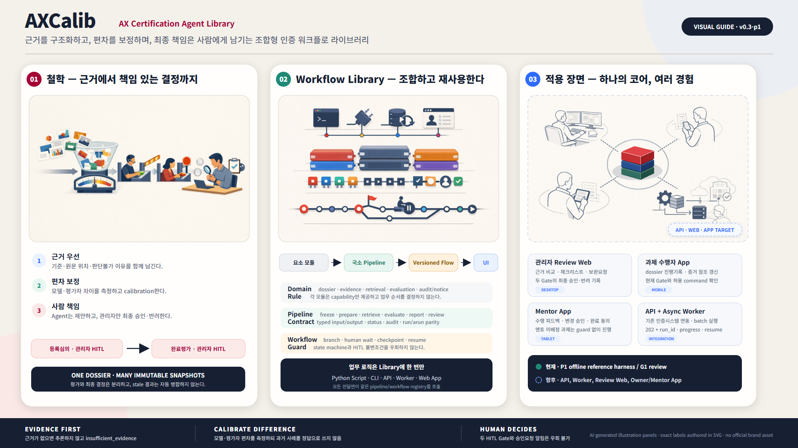

# AXCalib 철학·Workflow Library·적용 사례 Visual Guide

이 자료는 AXCalib를 단순한 “AI 평가 화면”이 아니라 **근거를 구조화하고, 평가 편차를
보정하며, 두 번의 사람 승인 Gate를 지키는 조합형 Python Library**로 이해하기 위한 시각
가이드다. SVG가 편집 가능한 기준본이고 PNG는 1920×1080 배포용 렌더다.

Excalibur의 “권한 있는 사람만 칼을 뽑는다”는 이미지는 **기억 장치**다. 공식 어원이나
Agent 자동인증을 뜻하지 않는다. 제품 문장은 “근거가 자격을 만들고, 보정이 판단을 맞추며,
권한 있는 사람이 인증한다”다.

- [편집 가능한 SVG](diagrams/axcalib-ecosystem-infographic.svg)
- [1920×1080 PNG](diagrams/axcalib-ecosystem-infographic.png)
- [기존 module/workflow 한 장 구조도](diagrams/workflow-at-a-glance.svg)

## 1. AXCalib의 철학

### Evidence first

criterion 판단에는 원문 위치, 적용 기준 버전, 유사사례 참조 또는 판단불가 이유가 연결된다.
근거가 부족하면 모델이 내용을 채우지 않고 `insufficient_evidence`로 남긴다.

### Calibrate difference

AXCalib의 `Calib`는 Certification + Agent + Library와 Calibration을 함께 뜻한다. 단일 모델의
점수를 정답으로 취급하지 않고 모델·평가자 간 차이, 불일치와 confidence를 측정한다. 과거
유사사례도 일관성 점검 자료이며 자동 합격 근거가 아니다.

### Human decides

Agent는 등록심의와 완료평가에서 평가초안, 통과·미통과 제안과 리포트를 만든다. 최종 등록
승인·반려와 완료 수용·미수용은 관리자 HITL 뒤에만 기록된다. 승인요청 notification event가
기록되지 않으면 HITL pending 전이도 완료하지 않는다.

## 2. Workflow Library 활용 방법

~~~text
요소 모듈
  dossier · evidence · retrieval · evaluation · reports · audit/notification
      ↓ 조합
국소 Pipeline
  dossier.freeze · evidence.prepare · cases.retrieve
  registration.evaluate · completion.evaluate · report.render · review.request
      ↓ 연결
Versioned Total Workflow
  branch · human wait · checkpoint · resume
      ↓ 같은 Library를 호출
Python Script · CLI · API · Async Worker · Review Web/App
~~~

요소 모듈은 한 capability만 제공한다. 국소 pipeline은 typed input/output, 명시적 status와 audit
metadata를 가진 하나의 업무 목적을 완결한다. 전체 workflow는 allowlisted pipeline의 버전을
연결해 분기와 사람 대기·재개를 담당한다. 어느 계층도 domain state machine, mandatory HITL,
notification, mentor guard, revision/snapshot 검증을 우회할 수 없다.

다음 코드는 현재 구현된 최소 public API다.

~~~python
from pathlib import Path

from axcalib import AXCalib
from axcalib.pipelines import TwoGatePptxRequest

client = AXCalib.from_toml(
    "config/axcalib.toml",
    workspace="output/review",
)
result = client.run_pptx(
    TwoGatePptxRequest(
        proposal_path=Path("proposal.pptx"),
        title="검토할 과제",
    )
)
~~~

on-prem expert profile은 계약만 있고 아직 실행되지 않는다.

local pipeline/workflow registry는 고급 API로 남기고 quickstart에 한꺼번에 노출하지 않는다.
API는 OpenAPI 3.1의 allowlist된 typed JSON options만 받으며 HITL·알림·사람 최종결정은
config로 끌 수 없다.

## 3. 예상 API/Web/App 적용 사례

| 적용면 | 주 사용자 | 예상 경험 | 호출하는 Library capability | 현재 상태 |
|---|---|---|---|---|
| 관리자 Review Web | 관리자·평가자 | criterion별 근거 비교, checklist, 보완요청, 최종 decision | evaluation result 조회, review request/decision command | Target, 미구현 |
| 과제 수행자 App | 과제 Owner | dossier 진행기록, evidence reference 추가, 현재 Gate와 allowed command 확인 | dossier update/freeze, completion submit | Target, 미구현 |
| Mentor App | 배정 Mentor | comment, 변경 승인, 완료 제출 동의 | mentor event, completion guard | Target, 미구현 |
| API | 기존 인증시스템 | revision-aware command, result/report 조회, OpenAPI client | 같은 pipeline/workflow registry | Target, 미구현 |
| Async/Batch Worker | 운영자·연동시스템 | `202 + run_id`, progress, item별 retry/resume | long-running parse/evaluate workflow | Target, 미구현 |
| Python/Offline Harness | 개발자·설계 검토자 | supplied-PPTX 두 Gate, report, fail-closed 확인 | `AXCalib`, `two-gate-pptx@v1alpha1` | G2 offline slice |

Web은 chatbot이 아니라 **review cockpit**이 주 화면이다. Web/App은 dossier를 직접 수정하거나
판정 로직을 재구현하지 않고 API가 제공하는 state, evidence locator, allowed command를 소비한다.
모바일은 queue 확인, comment와 승인 요약에 적합하고 정밀한 근거 비교는 desktop을 기본으로
본다.

## 4. 현재와 향후를 읽는 법

- 실선·진한 코어: 현재 문서화되거나 local/offline slice에서 검증된 계약
- 점선·옅은 적용면: API, Worker, Web/App 등 향후 Target
- 붉은 Gate: 등록심의와 완료평가의 관리자 HITL
- 중앙 dossier/snapshot: 사용자 기준 dossier 하나와 평가 시점의 immutable revision

이 자료는 제품 전체가 구현됐다는 표시가 아니다. 현재는 dossier/snapshot, 제한된 PPTX ingest,
deterministic evaluator/report와 두 HITL을 연결한 **G2 local/offline slice**다. 실제 evaluator
model, Vector DB, durable 운영 notification, API와 Web/App은 아직 구현되지 않았다.

## 5. 생성 자산과 재현 기록

| 자산 | 역할 |
|---|---|
| [axcalib-philosophy.jpg](diagrams/assets/axcalib-philosophy.jpg) | 근거 → 보정 → 사람 승인 철학 패널 |
| [axcalib-composable-library.jpg](diagrams/assets/axcalib-composable-library.jpg) | module → pipeline → workflow → interface 패널 |
| [axcalib-application-cases.jpg](diagrams/assets/axcalib-application-cases.jpg) | 관리자·수행자·멘토·연동시스템 적용 패널 |
| [axcalib-ecosystem-infographic.svg](diagrams/axcalib-ecosystem-infographic.svg) | 정확한 한국어 라벨과 현재/향후 상태를 가진 편집 기준본 |
| [axcalib-ecosystem-infographic.png](diagrams/axcalib-ecosystem-infographic.png) | 발표·문서 삽입용 1920×1080 렌더 |

일러스트 패널은 `imagegen`의 `gpt-image-1.5`, `1536x1024`, `quality=medium`,
`infographic-diagram`으로 생성했다. 긴 문구를 이미지 모델에 맡기지 않고 text-free panel로
생성한 뒤, 정확한 한국어 라벨과 상태 표시는 SVG에서 작성했다. 공식 로고·폰트·브랜드 자산은
사용하지 않았고 실제 과제 데이터나 live AXCalib model endpoint도 호출하지 않았다.
