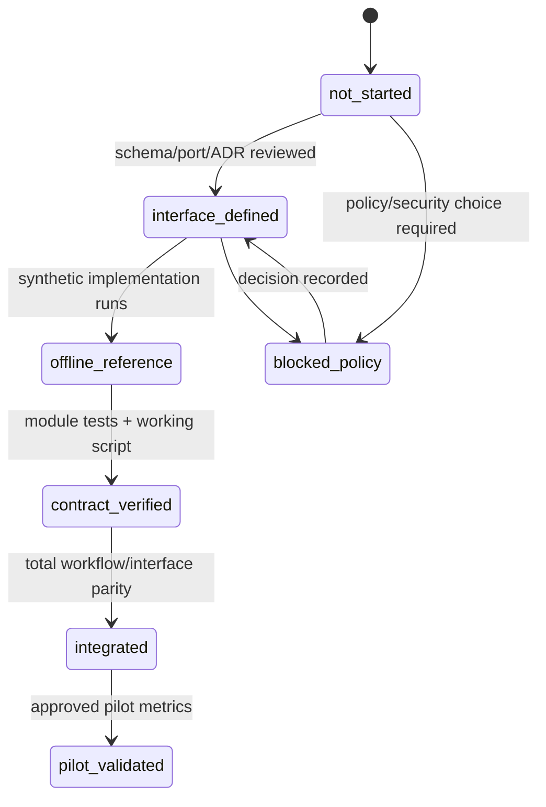

# AXCalib Module별 상세 작업계획

이 문서는 module별 책임, 입력·출력, 의존성, 첫 구현 slice, 검증과 완료증거를 고정한다.
현재 날짜 기반 일정은 Owner와 공수가 정해지지 않아 약속하지 않으며 dependency Wave와 Exit
Evidence로 예측 가능성을 확보한다.

## 1. Module Control Board

| ID | Package / Surface | 현재 상태 | 목표 WP | 직접 선행조건 | 다음 Exit Evidence |
|---|---|---|---|---|---|
| M00 | `axcalib.pipelines` | offline_reference | WP-01 | P1 harness | full context/idempotency/cancel contract |
| M01 | `axcalib.dossier` | offline_reference | WP-01 | core/schema contract | JSON Schema + multi-process CAS/lock |
| M02 | state/approval domain | offline_reference | WP-01 | M01 | persisted transition + outbox integration |
| M03 | `axcalib.ingest` | offline_reference | WP-02 | ArtifactRef/schema | actual-template + slide-render/VLM gold coverage |
| M04 | `axcalib.retrieval` | offline_reference | WP-04 | M03 normalized chunk contract | labeled set + embedding/Qdrant contract |
| M05 | `axcalib.evaluation` | offline_reference | WP-03/05 | M01, M03, M04 | gold traceability/unsupported-claim benchmark |
| M06 | `axcalib.calibration` | not_started | WP-05/06 | M05 | disagreement/agreement metric report |
| M07 | `axcalib.reports` | offline_reference | WP-03 | M05 | golden/redaction/content-hash contract |
| M08 | review/notification/audit | offline_reference | WP-01/03 | M02, M07 | durable outbox + idempotent retry/recovery |
| M09 | `axcalib.workflows` | offline_reference | WP-06 | M00~M08 | durable checkpoint/resume exactly once |
| M10 | `axcalib.runtime` | offline_reference | WP-01/05 | config contract | effective-config hash/source manifest |
| M11 | scripts / CLI | offline_reference | WP-01/06 | M00, M10, target pipeline; M09 for workflow | Typer CLI and script result parity |
| M12 | API / worker | not_started | WP-06 | M09, M10 | OpenAPI/202/SSE/resume contract |
| M13 | Web Review | blocked_policy | WP-07 | M12, FE selection | selected-stack E2E review flow |

`offline_reference`는 제품 module 완료가 아니다. 현재 supplied-PPTX local slice에서 실행되고
회귀 test가 있다는 뜻이며, 각 행의 다음 Exit Evidence가 남아 있다.

### 1.1 2026-07-16 slice evidence

- `src/axcalib/client.py`와 `src/axcalib/pipelines/project.py`: allowlisted sync/async two-gate flow
- `src/axcalib/dossier/repository.py`: YAML revision, atomic replace, immutable snapshot
- `src/axcalib/ingest/pptx.py`: limited safe OOXML + hash-bound reviewed sidecar
- `src/axcalib/evaluation/offline.py`, `reports/render.py`: criterion/locator JSON·Markdown 초안
- `scripts/pipelines/run_two_gate_pptx.py`: thin working script
- `tests/integration/test_pptx_two_gate_pipeline.py`: 두 Gate, wait, fail-closed, same-hash guard
- `evals/pptx_vertical_slice.py`: 제공 PPTX quality-claim 제한이 있는 offline 회귀
- `config/review_profiles/axcalib-default-v1.yaml`: 두 Gate criterion/reference/checklist hash를
  묶은 offline reference policy
- `src/axcalib/ingest/docling_pptx.py`: optional Docling version/status/page/text manifest
- `src/axcalib/models/openai_compatible.py`, `evaluation/model.py`: Responses/Chat Completions
  structured-output와 evidence-locator guard
- `evals/retrieval_baseline.py`: 작은 stage-separated synthetic Recall@5/nDCG@5/leakage 회귀
- `tests/integration/test_model_gateway.py`: 두 Gate fake-model/HITL contract와 provider dialect
- 사용자 승인 비식별 live registration smoke: transport 성공, 7/7 criterion insufficient로
  보수 정규화, 관리자 결정 없이 HITL pending

## 2. 공통 납품 단위

모든 module은 아래 산출물을 같은 change set에서 제공한다.

1. versioned input/output schema 또는 Protocol
2. 명시적인 error/status 의미
3. core 구현 또는 adapter port
4. network 없는 unit test
5. in-memory/fake adapter integration test
6. 필요한 경우 thin working script
7. eval 또는 회귀 metric
8. run manifest/audit 연결
9. README/DESIGN/요구 추적표 갱신
10. `prep.ps1 validate|test|eval`, Ruff, Pyright 결과

하나라도 없으면 `contract_verified`로 승격하지 않는다.

## 3. Module Cards

### M00 — Pipeline Kernel (`src/axcalib/pipelines`)

- 책임: PipelineContext, PipelineRun, status enum, Pipeline Protocol, allowlisted Registry
- 입력: typed request, actor/revision/version/idempotency context
- 출력: typed output와 succeeded/waiting/blocked/stale/failure 상태
- 의존성: core ID/clock/error Protocol 외 외부 framework 없음
- 첫 slice: `dossier.freeze/v1alpha1`가 사용할 최소 generic 계약
- 검증: sync/async parity, registry duplicate/version rejection, serialization, cancellation
- 완료증거: public import, unit/contract test, pyright, API/Web import 없음

### M01 — Dossier / Snapshot (`src/axcalib/dossier`)

- 책임: dossier schema, YAML round-trip, revision, canonical hash, atomic write, snapshot
- 입력: dossier command, expected_revision, artifact/rubric references
- 출력: new revision, immutable snapshot, conflict/stale result
- 의존성: core/schema와 filesystem repository port; local pipeline wrapper는 M00 사용
- 첫 slice: synthetic dossier의 `dossier.freeze/v1alpha1`
- 검증: JSON Schema, lossless round-trip, deterministic SHA-256, stale write rejection
- 완료증거: working freeze script와 temporary filesystem integration test

### M02 — State / Approval Domain

- 책임: registration/execution/completion 전이, 역할, mentor guard, final decision 권한
- 입력: domain command, actor, current status, expected revision
- 출력: transition event 또는 policy error
- 의존성: M01; notification delivery 구현에는 의존하지 않음
- 첫 slice: P1 `TwoGateWorkflow`를 persisted dossier transition에 연결
- 검증: 금지 전이, 관리자 전용 final 상태, mentor 승인, reject terminal
- 완료증거: property/transition table test와 audit event

### M03 — Evidence Ingest (`src/axcalib/ingest`)

- 책임: 접근검사 후 parse/normalize하고 evidence locator와 경고 생성
- 입력: ArtifactRef, access context, parser profile
- 출력: EvidenceDocument/Bundle, locator, parse warning, coverage metric
- 의존성: ArtifactRef/schema와 artifact store port; Docling/renderer는 optional adapter
- 첫 slice: Markdown/TXT synthetic fixture, 이후 제한된 PPTX
- 검증: locator round-trip, unsupported file, malformed input, secret/PII fixture scan
- 완료증거: parser regression dataset과 required-field coverage

### M04 — Retrieval (`src/axcalib/retrieval`)

- 책임: stage-aware case search, rerank, case aggregation, corpus version
- 입력: stage query, metadata/access filter, corpus snapshot
- 출력: RetrievalResult, hits, commonality/difference context, status
- 의존성: M03 normalized chunk contract; vector backend와 분리
- 첫 slice: 현재 Null/Lexical contract를 pipeline과 manifest에 연결
- 검증: registration/completion leakage, empty/unavailable, deterministic ordering
- 완료증거: labeled set Recall@k/nDCG@k와 Qdrant adapter contract

### M05 — Evaluation / Rubric (`src/axcalib/evaluation`)

- 책임: checklist, deterministic rule, model finding, evidence binding과 recommendation
- 입력: snapshot, rubric version, EvidenceBundle, RetrievalResult, model profile
- 출력: criterion별 assessment, evidence refs, unsupported/insufficient flags
- 의존성: M01, M03, M04; model은 port 뒤에 둠
- 첫 slice: mock evaluator로 등록심의 report data 생성
- 검증: Pydantic structured output, locator 필수, invalid model output rejection
- 완료증거: registration/completion fixture traceability와 unsupported-claim metric

### M06 — Calibration (`src/axcalib/calibration`)

- 책임: 규칙·모델·평가자 간 disagreement, agreement, confidence diagnostics
- 입력: 독립 model findings와 human labels
- 출력: criterion 분포, disagreement flags, calibration metrics
- 의존성: M05와 승인된 evaluation dataset
- 첫 slice: deterministic mock panel의 차이 리포트
- 검증: model ordering 독립성, missing panel result, boundary case
- 완료증거: agreement/confusion/ECE 또는 승인된 대체 metric report

### M07 — Reports (`src/axcalib/reports`)

- 책임: typed result를 Markdown/JSON 및 향후 PDF로 렌더링
- 입력: evaluation result, run manifest, review/audit references
- 출력: content-hashed report artifact
- 의존성: M05; renderer는 decision을 계산하지 않음
- 첫 slice: deterministic registration report Markdown/JSON
- 검증: required sections, evidence links, redaction, stable JSON schema
- 완료증거: golden/snapshot test와 report hash

### M08 — Review / Notification / Audit

- 책임: review request, mandatory notification outbox, administrator decision, audit append
- 입력: report ref, target revision, required role, notification profile
- 출력: waiting_human checkpoint, outbox/delivery ref, decision audit
- 의존성: M02, M07; GitLab/email은 adapter
- 첫 slice: RecordingNotifier와 atomic local outbox
- 검증: notification fail-closed, retry dedupe, unauthorized resume, secret-free payload
- 완료증거: 두 Gate notification count와 outbox recovery scenario

### M09 — Total Workflow Runtime (`src/axcalib/workflows`)

- 책임: versioned graph, pipeline 연결, branch, wait/resume, checkpoint, failure propagation
- 입력: workflow id/version, request, PipelineRegistry, runtime context
- 출력: workflow run state, current node, allowed command, checkpoint
- 의존성: M00~M08의 검증된 contract
- 첫 slice: `two-gate-standard/v1` synthetic workflow
- 검증: approve/reject/needs_changes, stale, retry, cancel, resume exactly once
- 완료증거: workflow scenario dataset과 replayable run manifest

### M10 — Runtime Profiles (`src/axcalib/runtime`)

- 책임: config를 검증하고 승인된 adapter를 생성자 주입하는 composition root
- 입력: offline/on-prem profile과 환경변수 이름
- 출력: dependency container, pipeline/workflow facade
- 의존성: 각 module의 port; secret 값은 model/report에 전달하지 않음
- 첫 slice: filesystem + lexical + mock + recording offline profile
- 검증: runtime JSON Schema, unknown/protected key, missing capability, unknown adapter, literal secret rejection
- 완료증거: clean terminal에서 같은 profile로 재현되는 container contract와 effective-config hash/source map

### M11 — Working Scripts / CLI

- 책임: arguments/file I/O, runtime 생성, library 호출, exit code/serialization
- 입력: path, allowlisted profile과 progressive command options
- 출력: PipelineRun/WorkflowRun의 사용자용 표현
- 의존성: M00, M10과 target pipeline부터 시작하고 workflow command는 M09 사용
- 첫 slice: `scripts/pipelines/run_dossier_freeze.py`
- 검증: script에 domain import/판정 복제 없음, CLI와 구조적 output parity
- 완료증거: documented PowerShell command와 smoke test

### M12 — API / Worker

- 책임: auth/HTTP boundary, async job, 202/run_id, SSE/poll, worker resume
- 입력: OpenAPI command, expected revision, Idempotency-Key
- 출력: typed response와 workflow status event
- 의존성: M09, M10; FastAPI/queue는 delivery adapter
- 첫 slice: in-process worker의 registration evaluation job
- 검증: versioned OpenAPI 3.1 artifact/example, unknown option rejection, auth scope, idempotent retry, partial failure, cancellation
- 완료증거: API contract test와 script/CLI/API result parity

### M13 — Web Review

- 책임: workflow state, evidence, checklist, allowed command와 audit를 사람에게 표시
- 입력: OpenAPI client와 SSE/poll event
- 출력: authorized review command; domain state를 브라우저에서 계산하지 않음
- 의존성: M12, frontend stack/design 선택, auth/RBAC 결정
- 첫 slice: registration review workbench read/approve/reject/request-evidence flow
- 검증: 사람 권한 경계 가시성, 접근성, revision conflict, pending notification, permission/E2E
- 완료증거: 선택한 FE stack의 핵심 사용자 flow와 reviewer usability review

## 4. Dependency Wave 계획

### Wave 0 — Harness와 시각 baseline

- 상태: 완료; local/offline slice 착수 지시는 2026-07-16 반영
- 범위: 실행 harness, reference workflow, ADR-013/014, workflow blueprint, module plan,
  product/manual/API/readiness contract
- Exit: validate/test/eval, 문서 링크·SVG/config/OpenAPI 검증 완료; 공식 rubric/운영 승인은 별도

### Wave 1 — WP-01 Foundation Vertical Slice

- 상태: supplied-PPTX total flow 안의 offline slice 구현, hardening 미완료
- 범위: M00, M01, M02, M08 일부, M10 offline, M11 working script
- 시작근거: 2026-07-16 사용자 local/offline 구현 지시
- 핵심 demo: 한 dossier를 두 Gate에서 freeze하고 같은 revision/hash를 재현
- 실패기준: stale write 또는 관리자 권한 우회를 허용하면 Gate 실패
- 남은 Exit: 독립 freeze pipeline, JSON Schema, idempotency와 durable atomic outbox

### Wave 2 — WP-02/03 Evidence-to-Report

- 상태: reviewed-sidecar + Docling manifest + policy/structured-model reference 구현;
  template/parser gold benchmark 미완료
- 범위: M03, M05 deterministic/structured reference, M07
- 시작조건: M00/M01 contract_verified
- 핵심 demo: synthetic 등록자료 → locator → criterion → Markdown/JSON report
- 실패기준: 근거 없는 충족판정 또는 locator 누락
- Exit: offline registration/completion report traceability

### Wave 3 — WP-04/05 Retrieval·Model·Calibration

- 상태: synthetic lexical metric과 single-model structured contract만 구현; vector/panel/calibration 미완료
- 범위: M04 vector/hybrid, M05 model adapter, M06
- 시작조건: 승인된 synthetic/labeled dataset과 model/corpus policy
- 핵심 demo: stage-aware cases + independent model findings + disagreement report
- 실패기준: stage leakage, invalid structured output 성공 처리, raw similarity 자동판정
- Exit: retrieval/model evaluation baseline; 운영승격은 별도 결정

### Wave 4 — WP-06 Workflow와 Interfaces

- 범위: M09, M11 full CLI, M12
- 시작조건: 필요한 local pipeline contract_verified
- 핵심 demo: two-gate wait/resume을 script/CLI/API에서 같은 run 의미로 실행
- 실패기준: interface별 상태/판정 차이, duplicate notification/decision
- Exit: workflow integrated, async/batch/API contract 통과

### Wave 5 — WP-07/08 Web과 Pilot

- 범위: M13, de-identified pilot, calibration
- 시작조건: FE 선택, RBAC/data/security 승인, M12 integrated
- 핵심 demo: reviewer가 evidence와 Agent 초안을 확인하고 authorized decision 수행
- 실패기준: Web이 상태를 재계산하거나 사람 승인 없는 자동 final transition
- Exit: 주요 사용자 E2E와 Continue/Narrow/Stop 근거

## 5. Module Change Template

각 module 작업은 PR/작업기록에 다음을 채운다.

~~~text
Module ID / version:
Target WP / Wave:
Requirement IDs:
Input/output schema changed:
Dependencies added/changed:
Invariants affected:
Files changed:
Unit/integration/contract/eval commands:
Results and failures:
Artifacts / run manifest:
Docs and diagrams updated:
Unverified/live work:
Next blocker/owner decision:
~~~

## 6. 상태 승격 규칙

상태 승격 때 `PROJECT_STATE.md`, 이 Control Board, 관련 workflow diagram과 요구 추적표를 같은
change set에서 갱신한다.

## 7. 다음 실행 가능한 작업

현재 next는 G3 reference 이후 Wave 1 hardening과 G3 품질 benchmark다.

1. M01 dossier JSON Schema export와 snapshot manifest 검증
2. M00 typed context/idempotency key와 stale/cancel/retry 상태 연결
3. M08 durable local outbox, notification dedupe와 recovery test
4. M03 실제 template 도착 시 field/locator fixture와 slide-render/VLM coverage 추가
5. M04 labeled query-case set, embedding/Qdrant adapter와 stage leakage benchmark
6. M05 approved gold label의 traceability/unsupported-claim과 on-prem Qwen contract
7. M11 Typer CLI를 같은 `two-gate-pptx@v1alpha1` pipeline에 연결
8. `prep.ps1 validate|test|eval`, Ruff, Pyright 회귀

실제 data, 추가 live model, Vector DB, API/Web은 readiness 문서의 승인 Gate를 유지한다.
