# AXCalib Workflow Blueprint

이 문서는 AXCalib의 전체 workflow, 국소 pipeline, module dependency, 사람 승인과 실패·재개
경로를 시각적으로 고정한다. 0절은 현재 실행되는 slice이고, 나머지 다이어그램에는 향후
Docling/model/outbox/worker/Web Target도 포함된다. FastAPI node는 runtime과 principal-bound
project·education command의 local Alpha 범위만 구현됐으며 운영 OIDC/RBAC·실제 교육 배정 원장·
immutable upload·202 worker가 완료된 것으로 해석하지 않는다.
P/WP/G 일정, Active Slice와 작업 이력은 단일 실행 원장
[PROJECT_STATE.md](../../PROJECT_STATE.md)에서 관리한다.

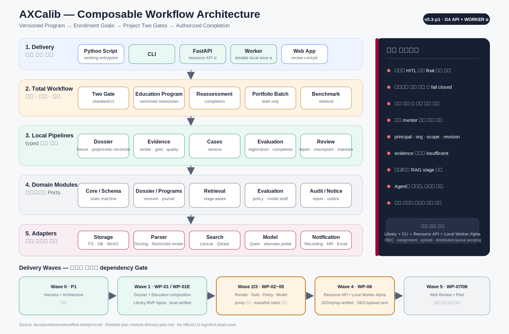

## 0. 현재 실행되는 supplied-PPTX G3 reference slice

```mermaid
flowchart LR
    SRC["PPTX + hash-bound sidecar"] --> POLICY["explicit review profile\nversion + SHA-256"]
    POLICY --> DOS["YAML dossier + revision"]
    DOS --> RSNAP["registration snapshot"]
    RSNAP --> RPARSE["OOXML / reviewed sidecar\n+ optional Docling manifest"]
    RPARSE --> RLEX["registration lexical cases\nportion 0.0"]
    RLEX --> REVAL["deterministic or strict structured\ncriterion report + locator guard"]
    REVAL --> RNOTE["recording notification"]
    RNOTE --> RWAIT{{"registration HITL wait"}}
    RWAIT -->|"explicit approve/reject + rationale"| EXEC["execution / progress notes"]
    EXEC --> FINAL["completion PPTX"]
    FINAL --> CSNAP["completion snapshot + registration baseline"]
    CSNAP --> CLEX["completion lexical cases\nportion 0.0"]
    CLEX --> CEVAL["same-hash guard + deterministic/model report"]
    CEVAL --> CNOTE["recording notification"]
    CNOTE --> CWAIT{{"completion HITL wait"}}
    CWAIT -->|"explicit accept/not_accept + rationale"| AUDIT["dossier decision + audit"]

    SRC -.-> RMAN["evaluation harness\nrestricted render manifest 16/16"]
    SRC -.-> GOLD["hash-bound reviewed gold\n13 locators / 12 fields"]
    RMAN -.-> QCHECK["evidence-quality gate\ncoverage + traceability"]
    GOLD -.-> QCHECK
    REVAL -.-> QCHECK
    CEVAL -.-> QCHECK

    classDef verified fill:#EAF8F4,stroke:#1E8A75,color:#172033;
    classDef human fill:#FFF3E4,stroke:#B36B00,stroke-width:2px,color:#172033;
    classDef quality fill:#EEF4FF,stroke:#2F6BFF,color:#172033;
    class SRC,POLICY,DOS,RSNAP,RPARSE,RLEX,REVAL,RNOTE,EXEC,FINAL,CSNAP,CLEX,CEVAL,CNOTE,AUDIT verified;
    class RWAIT,CWAIT human;
    class RMAN,GOLD,QCHECK quality;
```

이 slice는 `two-gate-pptx@v1alpha1`과 working script에서 실행된다. 기본은 network 없는
deterministic evaluator이고, 명시적 opt-in에서 Docling과 OpenAI-compatible structured evaluator를
같은 application service에 주입한다. image-only slide의 sidecar는 수동 검토 fixture이며
OCR/VLM 품질을 뜻하지 않는다. 현재 retrieval metric은 작은 synthetic lexical 회귀다. durable
local outbox, idempotency result store, effective-config, multi-process file lock, transaction recovery,
pipeline checkpoint/cancel, CLI/batch와 project API는 reference로 추가됐다. 별도
`evals/evidence_quality.py`는 runtime을 우회하지 않고 두 Gate report를 읽어 restricted
render 16/16, gold locator 13/13, reference field 12/12, criterion traceability 13/13과 unsupported
claim 0건을 회귀한다. 이 경로는 공식 rubric/VLM 의미 정확도를 주장하지 않는다. Vector DB,
exact model, full evaluation API와 운영 adapter는 다음 범위다.

### 0.1 현재 실행되는 교육 프로그램 → 프로젝트 인증 roll-up

```mermaid
flowchart LR
    PROGRAM["EducationProgram@0.1.0\nimmutable + hash"] --> ENROLL["Enroll learner\n3 generated goals"]
    ENROLL --> ORIENT["orientation\nmanual confirmation"]
    ORIENT --> PROJECT["project certification\nactual proposal PPTX"]
    PROJECT --> PGATES{{"registration + completion\n2 administrator HITL"}}
    PGATES -->|"stored completion_accepted"| SYNC["sync project requirement"]
    SYNC --> SCORE["final reflection\nscore ≥ 80"]
    SCORE --> PNOTICE["program completion notification"]
    PNOTICE --> PWAIT{{"program administrator HITL"}}
    PWAIT -->|approve| DONE["Enrollment completed"]
    PWAIT -->|return| REOPEN["selected milestone needs_action"]

    classDef verified fill:#EAF8F4,stroke:#1E8A75,color:#172033;
    classDef human fill:#FFF3E4,stroke:#B36B00,stroke-width:2px,color:#172033;
    class PROGRAM,ENROLL,ORIENT,PROJECT,SYNC,SCORE,PNOTICE,DONE,REOPEN verified;
    class PGATES,PWAIT human;
```

이 composition은 `education-program-runtime@v1alpha1`과
`examples/education_project_lifecycle/run_full_lifecycle.py`에서 실행된다. 프로젝트 dossier와
enrollment는 program/version/enrollment/milestone/learner context로 결합한다. 과정 완료도 local
unverified administrator command이며 공식 credential이 아니다.

### 0.2 Multimodal route qualification — proxy와 deployment 분리

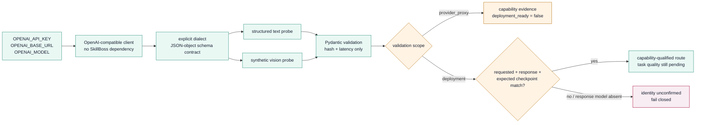

SkillBoss는 개인환경의 `provider_proxy` route로만 사용한다. 현재 `qwen3.5-plus` text/vision과
supplied-fixture registration, GPT-4o text/vision 대조는 통과했다. GLM 4.5V vision은 실패했고 exact
`Qwen3.5-397B-A17B` identity와 completion/gold 품질은 통과하지 않았으므로 READY node의 deployment
의미로 승격하지 않는다. raw output와 `reasoning_content`는 저장하지 않는다.

### 0.3 WP-06.I1 authenticated runtime API boundary

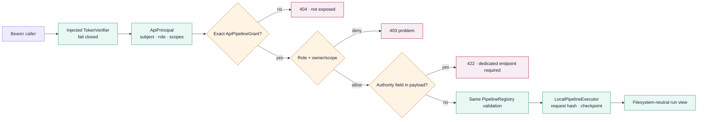

Library registry 등록은 HTTP 공개를 의미하지 않는다. verifier와 grant 기본값은 모두 닫혀 있고,
generic route는 request가 선언한 사람 identity나 관리자 결정을 신뢰하지 않는다. 기존
`openapi.v1alpha1.json`은 전체 제품 target, `openapi.runtime.v1alpha1.json`은 실제 구현된 route의
generated contract다.

### 0.4 WP-06.I2a principal-bound project command boundary

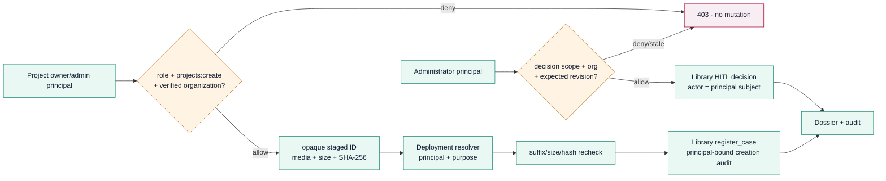

HTTP request에는 actor나 local path가 없다. 같은 idempotency key의 replay는 proposal/sidecar hash,
review context와 principal-bound creation audit가 모두 같을 때만 성공한다. 실제 OIDC와 immutable
staging service는 이 그림의 완료 범위가 아니다.

### 0.5 WP-06.I2b principal-bound education resource boundary

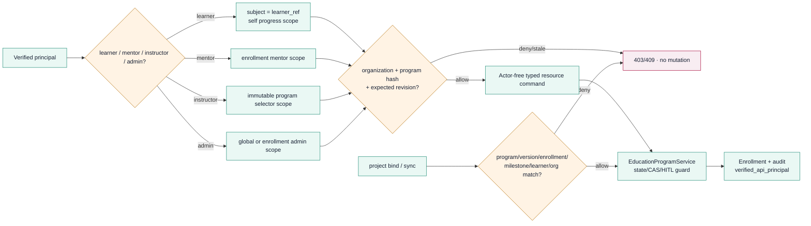

교육 request에는 actor, learner 또는 organization field가 없다. `Idempotency-Key`가 같은 동일 명령은
저장된 성공 결과를 replay하지만 다른 payload는 충돌한다. mentor/instructor assignment는 현재
deployment가 검증해 넣는 resource scope이며 실제 IdP·배정 원장 통합은 운영 Gate다.

## 1. 전체 계층

```mermaid
flowchart TB
    subgraph D["Delivery Interfaces — 업무 로직 없음"]
        PY["Working Python Script"]
        CLI["CLI"]
        API["FastAPI"]
        WORKER["Worker / Batch"]
        WEB["Web App"]
    end

    subgraph W["Versioned Total Workflows"]
        TGS["two-gate-standard/v1"]
        READY["registration-readiness/v1"]
        RECHECK["completion-reassessment/v1"]
        EDU["education-program-runtime/v1alpha1"]
        BATCH["portfolio-draft-batch/v1"]
        RETEVAL["retrieval-benchmark/v1"]
    end

    subgraph P["Reusable Local Pipelines"]
        DOSP["dossier.initialize / update / freeze"]
        EVIDP["evidence.prepare"]
        CASEP["cases.retrieve"]
        REGP["registration.evaluate / decide"]
        COMPP["completion.submit / evaluate / decide"]
        REVIEWP["review.request / report.render"]
        EDUP["program.publish / enroll / milestone / complete"]
        RECP["project / education transaction.reconcile"]
        RUNP["pipeline execute / checkpoint / cancel"]
        MAINTP["workspace.maintenance"]
    end

    subgraph M["Element Modules + Domain Invariants"]
        CORE["core / schemas / state machine"]
        DOS["dossier"]
        ING["ingest"]
        RET["retrieval"]
        EVAL["evaluation / calibration"]
        RPT["reports / notifications / audit"]
        PROGRAM["programs / enrollment progression"]
    end

    subgraph A["Provider Adapters"]
        STORE["Filesystem / SQLite / PostgreSQL / MinIO"]
        PARSER["Docling / slide renderer"]
        VECTOR["Null / Lexical / Qdrant"]
        MODEL["Mock / Qwen / alternate multimodal"]
        NOTICE["Recording / GitLab MR / Email"]
    end

    D --> W
    W --> P
    P --> M
    M --> A

    classDef delivery fill:#EEF4FF,stroke:#2F6BFF,color:#172033;
    classDef workflow fill:#FFF3E4,stroke:#B36B00,color:#172033;
    classDef pipeline fill:#EAF8F4,stroke:#1E8A75,color:#172033;
    classDef module fill:#F2F3F5,stroke:#5B6578,color:#172033;
    classDef adapter fill:#F8EDF2,stroke:#A50034,color:#172033;
    class PY,CLI,API,WORKER,WEB delivery;
    class TGS,READY,RECHECK,EDU,BATCH,RETEVAL workflow;
    class DOSP,EVIDP,CASEP,REGP,COMPP,REVIEWP,EDUP,RECP,RUNP,MAINTP pipeline;
    class CORE,DOS,ING,RET,EVAL,RPT,PROGRAM module;
    class STORE,PARSER,VECTOR,MODEL,NOTICE adapter;
```

의존 방향은 위에서 아래다. Module 또는 pipeline이 FastAPI, Web framework, GitLab/SMTP 구현을
직접 import하지 않는다. interface는 workflow/pipeline facade를 호출할 뿐 다음 상태나 평가
판정을 계산하지 않는다.

## 2. 공식 Two-Gate workflow

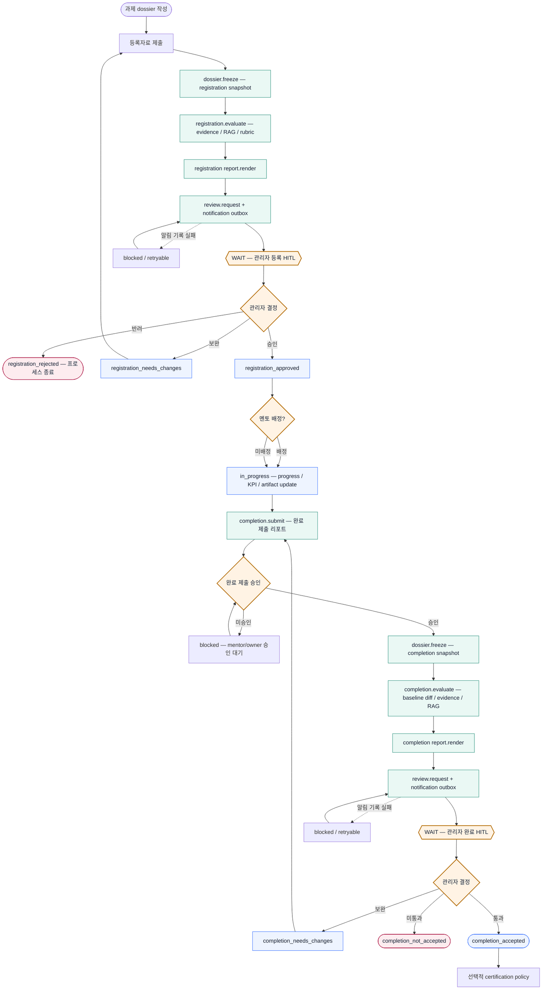

두 `WAIT` 노드는 외부 모델이나 Agent가 해제할 수 없다. 권한이 있는 관리자 command와 대상
revision/snapshot 검증이 있어야 재개된다.

## 3. 등록심의 실행 Sequence

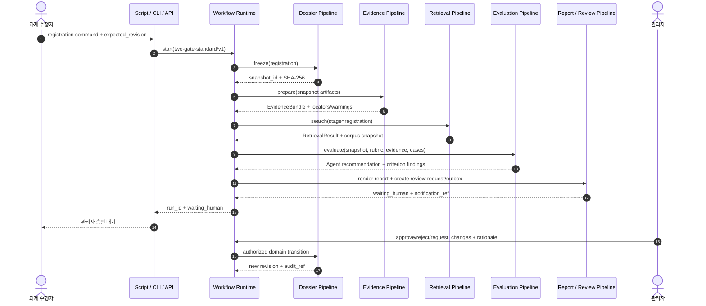

notification delivery는 outbox commit 이후 별도 worker가 처리할 수 있지만, 승인요청 event가
원자적으로 기록되지 않으면 `waiting_human`으로 진입하지 않는다.

## 4. 국소 Pipeline 내부 구조

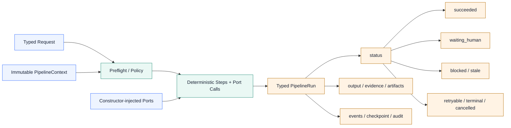

Pipeline은 숨은 global service locator를 쓰지 않는다. Port 구현은 runtime container가 생성자에
주입하고, context에는 실행·권한·version·revision 식별자만 둔다.

## 5. Module dependency

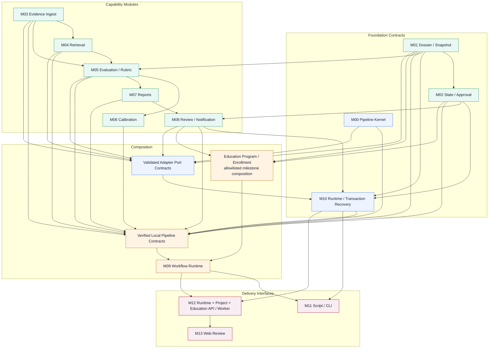

화살표는 선행계약 또는 조립 의존성을 뜻하며 Python import 방향과 구분해 해석한다. 요소
모듈은 pipeline/runtime package를 import하지 않는다. M03~M08은 공유 schema가 안정된 뒤 일부
병렬 개발할 수 있지만, M09 total workflow integration은 필요한 local pipeline contract가
검증된 뒤 수행한다.

## 6. 실패·대기·재개

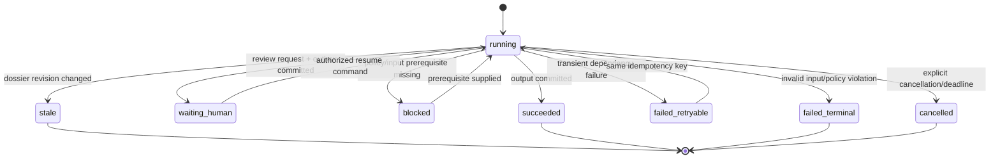

`stale`은 현재 dossier에 자동 병합하지 않는다. `failed_retryable` 재시도는 같은 idempotency
key를 사용하고 새 평가·알림·결정을 중복 생성하지 않는다.

### 6.1 WP-01.R1 local transaction recovery

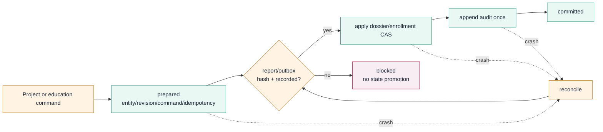

현재 recovery는 project dossier와 education enrollment의 audit를 적용하고 report/outbox는 immutable
prerequisite로 확인한다. reconcile은 notification adapter를 재호출하지 않는다. stale lock과 orphan
temp는 삭제하지 않고 quarantine하며 committed journal만 archive한다. report/outbox producer 자체와
database/distributed transaction은 후속 범위다.

### 6.2 Library Alpha run checkpoint와 batch

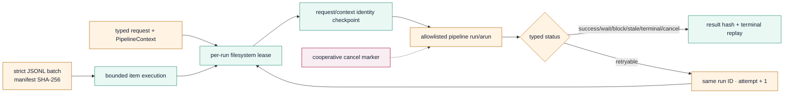

cancel은 process kill 또는 이미 commit된 domain mutation의 rollback이 아니다. terminal result와
성공 item은 재실행하지 않으며 result path/hash가 바뀌면 replay를 실패시킨다. 이 lease는 single-host
local Alpha 계약이고 distributed worker lease는 G4 이후 범위다.

## 7. Delivery Wave

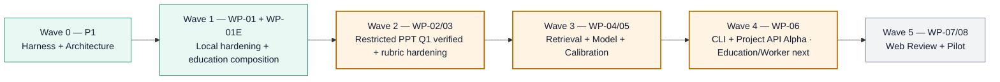

Wave는 달력 일정이 아니라 dependency Gate다. Owner, 인력과 운영환경이 확정되지 않았으므로
날짜를 임의로 약속하지 않는다. 각 Wave는 `module-delivery-plan.md`의 Exit Evidence가 모두
확인될 때만 다음 상태로 이동한다.

## 8. 다이어그램 변경 체크리스트

- [ ] pipeline/module ID가 module delivery plan과 일치한다.
- [ ] domain state machine과 다른 transition이 없다.
- [ ] 관리자 HITL과 notification fail-closed 경로가 유지된다.
- [ ] mentor 배정 시 completion 승인 guard가 유지된다.
- [ ] registration/completion retrieval stage가 섞이지 않는다.
- [ ] program/version/enrollment/milestone/learner binding이 정확하다.
- [ ] project accepted와 program completion 관리자 Gate가 분리된다.
- [ ] waiting, stale, retryable, terminal failure가 success와 구분된다.
- [ ] 현재 구현상태와 완료색이 일치한다.
- [ ] SVG 인포그래픽과 문서 인덱스를 함께 갱신했다.
