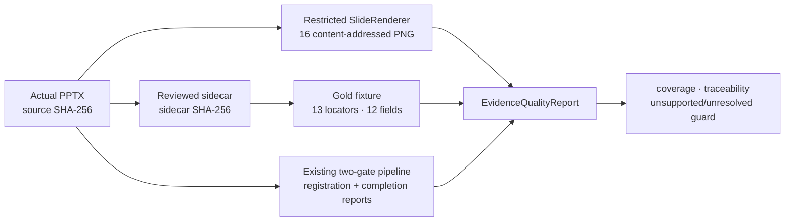

# WP-02.Q1 Actual-PPT Evidence Quality 개발·코드리뷰 리포트

## 1. 결론

사용자가 제공한 `oled_qc_project_outline.pptx`에 대해 visual provenance와 criterion 근거 연결을
재현 가능한 local/offline 품질 기준선으로 고정했다. 제한형 renderer는 16/16 slide를 생성했고,
13개 visual slide와 3개 true blank slide를 분리했다. hash-bound gold fixture 기준 locator recall은
13/13, reference-field coverage는 12/12, two-gate criterion traceability는 13/13이며 unsupported
assertion과 unresolved locator는 각각 0건이다.

이 결과로 `WP-02.Q1`은 완료할 수 있다. 다만 **해당 image-only fixture의 provenance·coverage 계약**만
검증한 것이며 일반 PPTX 렌더 정확도, OCR/VLM 의미 이해, 공식 rubric 품질 또는 실제 인증 판단
정확도를 검증한 것은 아니다.

## 2. 실행 구조

`evals/evidence_quality.py`는 기존 workflow를 복제하지 않는다. `AXCalib.run_pptx()`가 만든 등록·완료
report와 별도 ingest/render 결과를 읽어 품질 계약만 평가한다.

## 3. 산출물

| 역할 | 경로 | 핵심 계약 |
|---|---|---|
| Renderer port/adapter | `src/axcalib/ingest/slide_render.py` | single full-slide PNG 또는 true blank만 지원; 나머지는 fail-closed |
| Gold loader/quality metric | `src/axcalib/evaluation/evidence_quality.py` | source·sidecar·summary hash drift 및 locator 미해소 검출 |
| Gold dataset | `evals/datasets/oled_qc_pptx_evidence_gold.json` | 13 locator, 12 reference field; summary 원문은 복제하지 않음 |
| Quality runner | `evals/evidence_quality.py` | two-gate criterion과 optional Docling을 같은 report로 검증 |
| Regression tests | `tests/unit/test_slide_render.py`, `tests/unit/test_evidence_quality.py` | actual fixture 재현성, 합성 slide 거부, sidecar drift, unsupported assertion |
| Generated local artifacts | `output/wp02-evidence-quality/render-a`, `render-b` | ignored output; manifest와 16개 PNG, source data를 Git에 복제하지 않음 |

## 4. 고정 입력과 측정 결과

| 항목 | 결과 |
|---|---:|
| PPTX SHA-256 | `cb0a21ca59330921855f8e7ce4eb6496c47383750332682160ad48188018bd76` |
| Sidecar SHA-256 | `e35bd8d9e01ba326eb8759c81b4ad0b3f305a841501f2ea0cf0e482fff62a754` |
| Render manifest canonical SHA-256 | `91dcbf7bff5bfe9798302fe5044c3d21a5d028b5f411d7e71d7d667bab3599f6` |
| Slide render coverage | 16/16 |
| Visual / blank | 13 / 3; blank slide 6, 15, 16 |
| Pixel profile | 1672 × 941 RGB PNG |
| Reviewed locator recall | 13/13 = 1.0 |
| Reference-field coverage | 12/12 = 1.0 |
| Criterion traceability | 13/13 |
| Unsupported assertion | 0 |
| Unresolved evidence locator | 0 |
| OOXML text slide | 0 |
| Verified-sidecar slide | 13 |
| Docling | `docling/2.113.0:pptx`, 16 page, 0 text page |

반복 render 두 번의 canonical manifest hash와 16개 image hash 배열은 동일했다. blank PNG도 같은
pixel profile에서 결정론적으로 생성된다.

## 5. 코드리뷰 결과

1. **지원 범위가 명시적이다.** Office COM이나 LibreOffice 설치 상태에 기대지 않는다. 반대로
   composed slide를 부분적으로 성공 처리하지 않고 `SlideRenderError`로 종료한다.
2. **원본과 검토 주석이 함께 고정된다.** gold loader는 PPTX·sidecar hash와 13개 summary hash/tag
   전체를 비교한다. 주석 drift를 새 품질 결과로 조용히 승인하지 않는다.
3. **근거 없는 assertion을 통과시키지 않는다.** `met`, `partially_met`, `not_met` 판단은 해소 가능한
   slide/report/hash locator가 필요하다. `insufficient_evidence`와 `not_applicable`은 판단불가 이유로
   구분한다.
4. **실제 시각 의미를 과장하지 않는다.** Docling 0-text와 reviewed sidecar를 별도 source로 남기고,
   사람 전사 내용을 VLM 결과로 표시하지 않는다.
5. **남은 기술부채가 분리돼 있다.** general renderer, OCR/VLM, multi-template field mapping,
   production parser sandbox와 공식 semantic gold label은 이 slice 밖이다.

## 6. 검증

| 검증 | 결과 |
|---|---|
| 신규 unit regression | `6 passed` |
| `evals/evidence_quality.py` | passed; 13/13 locator, 12/12 field, 13/13 criterion |
| `evals/evidence_quality.py --with-docling` | passed; Docling 16 page / 0 text |
| Ruff 대상 파일 | all checks passed |
| Pyright 전체 `src harness evals tests` | 0 errors, 0 warnings |
| `prep.ps1 validate` | passed; 0 errors, 0 warnings |
| `prep.ps1 test` | passed; 66 tests |
| `prep.ps1 eval` | passed; 7 eval groups |
| `git diff --check` | whitespace error 없음; 기존 CRLF 안내만 발생 |

기본 eval은 network, GPU, API key, embedding 또는 Vector DB를 사용하지 않았다. Docling 실행도 local
parser였으며 원문을 외부 endpoint로 보내지 않았다.

## 7. 다음 단계

즉시 다음 dependency는 `WP-01.R1 transaction-journal-reconciliation`이다. 이후 공식 rubric owner가
정해지면 `WP-03.Q2 rubric/report gold benchmark`로 진행한다. 다른 실제 PPT template과 일반
renderer/OCR/VLM은 별도 fixture와 승인된 품질 Gate에서 다룬다.

관련 기준: [ADR-015](../adr/ADR-015-image-only-pptx-offline-evidence.md),
[Workflow Blueprint](../architecture/workflow-blueprint.md),
[Module Delivery Plan](../architecture/module-delivery-plan.md),
[Project Execution Ledger](../../PROJECT_STATE.md).
