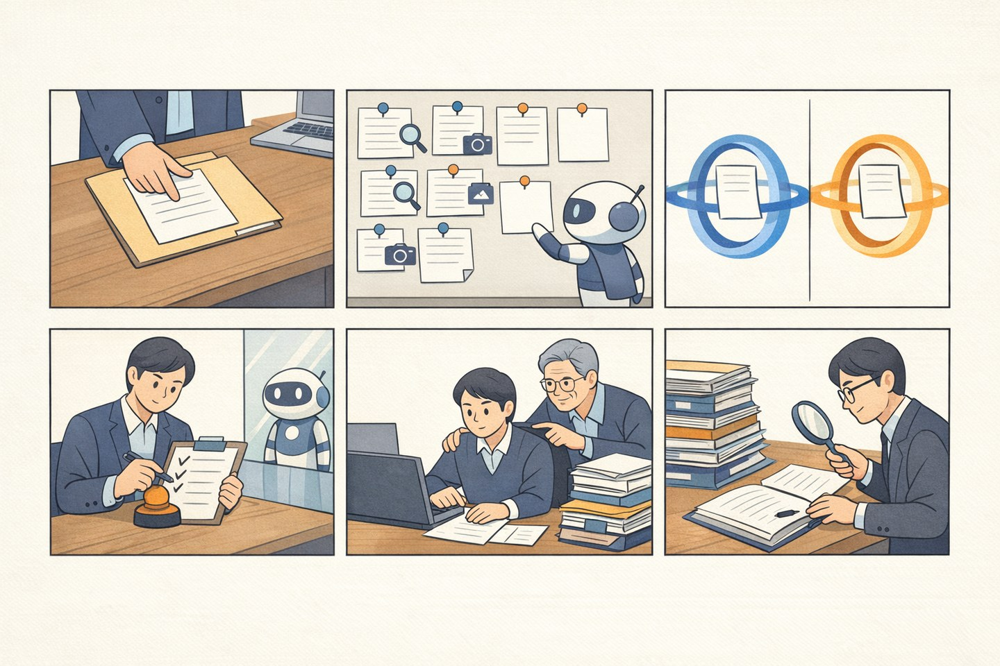

# 6컷 웹툰 튜토리얼

생성 이미지에는 역할 혼동을 줄이기 위해 문자를 넣지 않았다. 아래 캡션이 정확한 계약이다.

| 컷 | 장면 | 사용자가 배울 내용 |
|---:|---|---|
| 1 | 수행자가 단일 dossier에 증거를 건넨다 | 기준 파일은 project별 하나, 대용량 파일은 hash/URI 참조 |
| 2 | Agent가 locator를 붙이고 빈칸은 비워 둔다 | 근거 부족을 환각으로 채우지 않음 |
| 3 | 파란 등록 고리와 주황 완료 고리가 분리된다 | stage별 corpus·retrieval·rubric을 섞지 않음 |
| 4 | 관리자가 checklist와 알림을 확인하고 결정한다 | Agent는 경계 밖에서 기다리며 HITL을 우회하지 않음 |
| 5 | 승인 뒤 과제를 수행하고 선택적 mentor가 돕는다 | mentor가 있으면 완료 등록 전 승인 필요 |
| 6 | 완료 증거를 다시 평가하고 권한자가 확정한다 | 완료 HITL과 감사기록까지 있어야 프로세스가 끝남 |

## 강의용 10분 구성

1. 1분 — “칼을 누가 뽑는가”: 사람 책임 원칙
2. 2분 — dossier와 snapshot: 무엇을 평가했는가
3. 2분 — 두 Gate: 등록 목표와 완료 증거의 연결
4. 2분 — calibration/RAG: 비슷함과 정답의 차이
5. 2분 — HITL checklist와 알림: 왜 fail closed인가
6. 1분 — 최소 API와 expert profile: 어디까지 제어 가능한가

강사는 “Agent가 합격시킨다”라고 설명하지 않는다. “Agent가 근거 있는 제안을 만들고,
권한자가 승인한다”를 모든 컷에서 반복한다.
