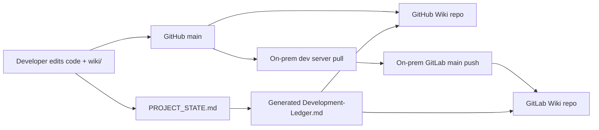

# GitHub/GitLab Wiki Publication Runbook

## 목적

`wiki/`의 같은 사용자 문서를 GitHub Wiki와 사내 GitLab Wiki에 배포한다. main repository와 두 Wiki는
서로 다른 Git 저장소이므로 코드 mirror만으로 Wiki가 자동 복사되지는 않는다.



## Local contract

```powershell
uv run --no-sync python scripts/wiki/sync_wiki.py validate
uv run --no-sync python scripts/wiki/sync_wiki.py export `
  --target github --output output/wiki-preview/github
uv run --no-sync python scripts/wiki/sync_wiki.py export `
  --target gitlab --output output/wiki-preview/gitlab
uv run --no-sync python tests/wiki_ci_contract.py
```

`prep.ps1 validate`도 Wiki source와 link contract를 검사한다.

## GitHub bootstrap

1. Repository Settings에서 Wiki가 enabled인지 확인한다.
2. GitHub Wiki 화면에서 최초 Home page를 한 번 만든다.
3. `git ls-remote https://github.com/OWNER/REPO.wiki.git`이 성공하는지 확인한다.
4. repository variable `AXCALIB_WIKI_PUBLISH_ENABLED=true`를 설정한다.
5. `.github/workflows/wiki.yml`을 수동 실행하고 validate와 publish job을 확인한다.
6. Home, sidebar, asset과 Development Ledger가 실제 화면에서 렌더링되는지 확인한다.

현재 public repository는 Wiki feature가 enabled지만 2026-07-23 read-only 확인에서
`Infant83/AXCalib.wiki.git`이 아직 clone되지 않았다. 최초 Home 생성 전에는 publish variable을 켜지 않는다.

## GitLab Self-Managed bootstrap

1. 사내 GitLab project의 `Plan > Wiki`가 enabled인지 확인하고 최초 Home을 만든다.
2. CI runner에 Python 3.12와 Git이 있는지 확인한다.
3. Wiki push 전용 SSH deploy key 또는 최소 범위 token을 구성한다.
4. protected CI/CD variables를 설정한다.
   - `AXCALIB_WIKI_CI_ENABLED=true`
   - `AXCALIB_WIKI_PUBLISH_ENABLED=true`
   - `AXCALIB_GITLAB_WIKI_URL=git@gitlab.example:group/project.wiki.git`
5. GitHub main을 pull하고 GitLab main에 push해 `.gitlab-ci.yml`의 두 job을 확인한다.
6. GitLab의 `_sidebar`와 Development Ledger를 실제 사용자 권한으로 확인한다.

사내 hostname, token과 private key를 파일·로그·issue에 붙이지 않는다. 실제 variable 이름은 저장소에
남을 수 있지만 값은 runner의 protected secret store에만 둔다.

## Manual dry-run and push

```powershell
$env:AXCALIB_GITLAB_WIKI_URL = "git@gitlab.example:group/project.wiki.git"
uv run --no-sync python scripts/wiki/sync_wiki.py publish `
  --target gitlab `
  --checkout output/wiki-checkouts/gitlab
```

이 상태는 dry-run이다. checkout의 `git status`와 렌더 결과를 확인한 뒤 명시적으로 전송한다.

```powershell
uv run --no-sync python scripts/wiki/sync_wiki.py publish `
  --target gitlab `
  --checkout output/wiki-checkouts/gitlab `
  --push
```

remote URL은 기본 환경변수 이름을 사용하므로 명령 인자나 process log에 secret URL을 넣지 않는다.

## Failure handling

| 증상 | 판단 | 조치 |
|---|---|---|
| repository not found | Wiki 미초기화 또는 권한 없음 | 최초 Home과 clone 권한 확인 |
| checkout dirty | 이전 dry-run/수동 편집 존재 | diff를 검토해 `wiki/`에 반영하거나 checkout 정리 |
| origin mismatch | 잘못된 Wiki에 push할 위험 | checkout을 재사용하지 말고 올바른 remote로 새로 clone |
| non-fast-forward | Wiki direct edit 또는 동시 publication | push 강제 금지, fetch 후 내용을 main `wiki/`에 조정 |
| renderer 차이 | Markdown/asset 호환 문제 | 플랫폼 중립 문법으로 수정하고 두 화면 재확인 |
| CI variable 없음 | 안전한 기본 차단 | Owner가 protected variable을 승인·설정 |

## Official platform references

- [GitHub: Adding or editing wiki pages](https://docs.github.com/en/communities/documenting-your-project-with-wikis/adding-or-editing-wiki-pages)
- [GitHub: About wikis](https://docs.github.com/en/communities/documenting-your-project-with-wikis/about-wikis)
- [GitLab: Project Wiki](https://docs.gitlab.com/user/project/wiki/)
