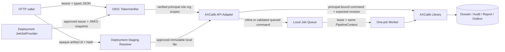

# AXCalib API and Identity Reference Threat Model

- 범위: WP-06.I1~I3 resource API/local Worker + WP-06.I4.1 provider-neutral OIDC/JWKS local reference
- 상태: local identity/resource contract verified, operational deployment **NO-GO**
- 기준일: 2026-07-24

## 1. 보호 대상과 신뢰 경계

보호 대상은 프로젝트 dossier와 revision, proposal/sidecar bytes, 교육 program/enrollment와 reviewer
assignment, 두 project HITL·과정 완료 결정권, audit event, notification/report reference, bearer
credential, identity policy와 issuer-bound JWK snapshot이다. 다음 경계를 분리한다.

`TokenVerifier`, `JwkSetProvider`와 `StagedArtifactResolver`는 deployment 소유 port다. 기본 verifier와
resolver는 모두 거부한다. 현재 `StaticJwkSetProvider`는 local signed fixture용이며 remote
discovery/cache/rotation adapter가 아니다. Library는 상태전이와 관리자 HITL을 최종적으로 다시
검사한다.

## 2. 위협과 현재 통제

| 위협 | 공격 예 | 현재 통제 | 남은 위험 |
|---|---|---|---|
| 신원 가장 | request에 다른 `actor_id` 삽입 또는 위조 JWT | actor field/authority field 거부, RFC 9068 type, asymmetric signature, exact issuer/audience/time/JTI 검증, audit actor는 principal subject | 실제 issuer·subject lifecycle·revocation 승인 필요 |
| token/key confusion | ID token, `none`/HS algorithm, token `jku/x5u` 또는 다른 issuer key 사용 | `at+jwt`, policy-owned RS256/PS256/ES256 allowlist, token-controlled key URL 거부, issuer/JWKS exact snapshot binding | remote discovery redirect/DNS/cache/rotation adapter 미구현 |
| 권한 상승 | project owner가 승인 command 호출하거나 IdP group을 admin role로 오매핑 | external role/scope exact allowlist와 단일 role, administrator role + explicit resource scope + organization을 mutation 전에 확인 | enterprise mapping/assignment Owner sign-off 필요 |
| key source 장애 | JWKS source가 stale/중단됐는데 기존 principal로 새 요청 승인 | invalid token 401, provider/config mismatch는 503, principal/token cache 없음 | bounded cache·refresh·rotation·outage drill 미구현 |
| IDOR/tenant 혼선 | 다른 조직 project ID로 조회·결정 | owner creation audit/admin read-or-decision scope와 dossier organization 또는 explicit organization scope 비교 | ownership transfer와 기존 local dossier migration 필요 |
| stale/lost update | 오래된 화면에서 승인 | 필수 `expected_revision`, domain service/repository CAS, stale 409와 무변경 회귀 | distributed database transaction 미구현 |
| 로컬 경로 주입 | `C:\\...` 또는 `../...` 읽기 | request에 path field 없음, opaque ID pattern, resolver만 local path 해석 | resolver 구현 자체의 ACL 검토 필요 |
| artifact 변조 | staging 뒤 bytes 교체 | media/suffix/size/hash, Library create 전 expected hash와 평가 전 frozen proposal hash 재검증 | 최종 hash 이후 변경 TOCTOU; immutable object version 필요 |
| replay/confused deputy | idempotency key 재사용 | principal+key 기반 project ID, request/hash/context/audit exact match만 replay | cross-process create serialization은 object-store/DB 설계 필요 |
| decision 응답 유실 | commit 뒤 응답을 못 받은 client가 재시도 | required key, principal/resource/payload-bound successful result replay와 authorized GET | commit-result write crash window와 distributed store 미구현 |
| 정보 노출 | path/token/자유서술/validation value가 응답에 반사 | project safe view에서 URI·note·mentor·rationale 제외, RFC 9457형 redacted problem, token 미기록 | report/evidence read와 운영 trace redaction 별도 검토 필요 |
| resource exhaustion | 거대 PPTX/sidecar 반복 hash | 64 MiB PPTX, 2 MiB sidecar metadata limit, default resolver deny | HTTP body limit, rate limit, timeout, malware/zip-bomb staging scan 미구현 |
| queued payload 노출 | API key 또는 민감 업무본문을 job JSON에 남김 | registry-validated object, 1 MiB bound, recursive known credential-key deny, payload hash와 workspace 내부 저장 | DLP가 아니며 ACL/encryption/retention 정책 미구현 |
| worker claim 경합 | lease 만료 후 두 process가 같은 job 실행 | claim 재검사, executor per-run lock, committed terminal result hash replay | heartbeat 없음; 장시간 작업의 첫 worker는 claim finalization을 잃을 수 있음 |
| retry 폭주 | terminal 오류를 무한 재시도 | retryable status만 동일 run/context에서 기본 최대 3회 exponential delay | distributed dead-letter/metrics와 provider별 retry policy 미구현 |
| 감사 불완전 | dossier만 남고 creation audit 누락 | replay 전에 principal-bound creation audit 존재 확인, transaction journal/reconcile | API가 자동 reconcile하지 않음; 운영 recovery runbook 필요 |
| 교육 actor 가장 | 다른 learner/mentor/instructor 문자열 삽입 | 교육 request schema에 actor/learner/org 없음, principal subject/role과 `verified_api_principal` audit | 실제 IdP·배정 원장 claim 검증 미구현 |
| 교육 resource IDOR | 다른 enrollment 확인·점수·완료결정 | learner subject/self scope, mentor enrollment scope, instructor program selector scope, admin scope와 organization 확인 | scope 발급·회수 source 미구현 |
| program/project 혼선 | 다른 program version 또는 조직 project를 milestone에 연결 | exact program SHA-256 pin, enrollment creation audit, bind와 sync에서 dossier context/org 재검증 | cross-service distributed transaction 미구현 |

## 3. 명령별 authorization matrix

| 명령 | role | scope | organization | revision | actor source |
|---|---|---|---|---|---|
| project register | project_owner 또는 administrator | `projects:create` | verified org 필수 | 생성 revision 1 | bearer principal |
| project read | project_owner 또는 administrator | owner `projects:read:own` + creation audit; admin `projects:read:any` 또는 `project:{id}:read` | dossier org match 또는 explicit org scope | current state | bearer principal |
| registration approve/reject | administrator | `projects:decide:any` 또는 `project:{id}:decide` | dossier org match 또는 explicit org scope | 필수 | bearer principal |
| completion accept/not_accept | administrator | 위와 동일 | 위와 동일 | 필수 | bearer principal |
| generic pipeline run | operator 또는 administrator + exact inline/queued delivery grant | grant가 역할 허용 | 아직 project resource scope 아님 | pipeline별 typed context; queued도 동일 | bearer principal |
| learner self enrollment | learner | `education:enroll:self` | verified org 필수 | exact program hash | bearer principal |
| milestone start/project bind | learner | subject match + `education:progress:self` | enrollment org match | 필수 | bearer principal |
| manual confirmation/score | configured mentor/instructor 또는 administrator | enrollment mentor / program instructor / admin scope | enrollment org match | 필수 | bearer principal |
| project status sync | assigned learner/mentor/instructor/administrator | 위 resource assignment scope | enrollment와 dossier org match | 필수 | bearer principal; evidence는 dossier |
| education completion approve/return | administrator | `education:admin:any` 또는 enrollment admin scope | enrollment org match | 필수 | bearer principal |

role 하나만으로 권한이 생기지 않는다. 사람 결정은 role, scope, organization, revision과 domain state
machine이 모두 허용해야 한다.

## 4. 운영 승격 전 필수 항목

- `identity-upload-decision-packet.md`의 승인된 issuer/audience/claim/lifetime/revocation/assignment 값
- HTTPS discovery/JWKS egress allowlist, bounded cache/refresh/key rotation과 장애 runbook
- immutable object storage 기반 upload/staging, access classification, malware scan, retention과 deletion
- reverse proxy body limit, rate limit, request timeout과 audit-safe trace ID
- database/broker transaction, worker heartbeat/dead-letter/metrics와 idempotency/job retention/commit recovery
- project list/report/evidence authorization 및 enumeration 방지
- education mentor/instructor assignment source, delegation/revocation와 scope claim test
- program publish/retire authorization과 legacy enrollment organization migration
- security test, dependency scan, penetration test와 운영 Owner 승인

이 항목이 없으므로 현재 app factory를 인터넷 또는 사내 운영망에 배포하지 않는다.
