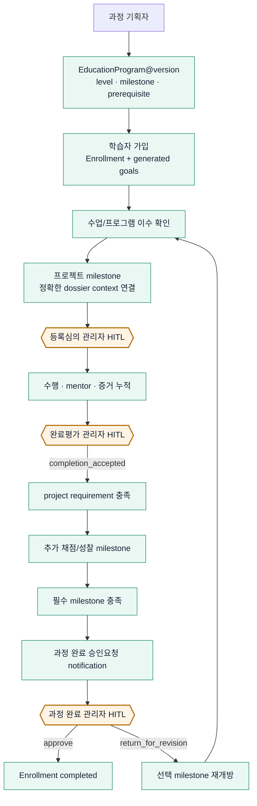

# 교육 프로그램 안에서 프로젝트를 인증하는 Lifecycle

이 문서는 과정 기획자가 program을 만들고, 학습자가 가입한 뒤, 실제 제출 프로젝트를 AXCalib의
두 Gate로 인증하여 과정 진도에 반영하는 reference workflow다. 현재 공식 인증 대상은
**제출 프로젝트**이며, 과정 전체 완료는 그 결과를 포함한 상위 progression 결정이다.

## 1. 세 개의 독립 기록

| 기록 | 역할 | 변경 방식 |
|---|---|---|
| `EducationProgram` | level·milestone·조건·pipeline blueprint | 새 version 발행, 기존 version 불변 |
| `EducationEnrollment` | 학습자별 생성 목표와 진행률 | revision-aware command로 갱신 |
| `ProjectDossier` | 제출 프로젝트의 등록·수행·완료 근거와 두 HITL | 기존 two-gate state machine 사용 |

가입은 exact `program_id@version`과 hash를 고정한다. 과정 파일이 바뀌어도 기존 가입의 목표가
조용히 바뀌지 않는다.

## 2. 전체 흐름

`completion_accepted`와 `Enrollment completed`는 서로 다른 사람 결정이다. 후자는 아직 공식
credential 발급이나 법적 인증을 뜻하지 않는다.

## 3. 과정 기획자가 설정할 수 있는 범위

alpha catalog는 다음 세 조건을 제공한다.

- `manual_confirmation`: instructor/mentor/administrator가 수업·프로그램 이수를 근거와 함께 확인
- `score_at_least`: 신뢰된 평가자가 0~100 점수를 기록하고 threshold 비교
- `project_status`: 연결된 AXCalib dossier가 `registration_approved` 또는
  `completion_accepted`인지 확인

milestone은 `all_required` 또는 `minimum_points` completion rule을 쓴다. prerequisite는 앞선
milestone만 가리킬 수 있다. YAML로 임의 Python 코드, import path, boolean expression을 실행할
수 없으며 과정 완료 관리자 Gate를 비활성화하는 option도 없다.

## 4. 최소 Library 사용 순서

~~~python
from axcalib import AXCalib
from axcalib.pipelines import (
    BindProjectCommand,
    EnrollCommand,
    SyncProjectCommand,
)
from axcalib.programs import load_program
from axcalib.schemas import ReviewContext

ax = AXCalib.from_toml("config/axcalib.toml", workspace="output/education-demo")
program = load_program("fixtures/synthetic/education_project_lifecycle/program.yaml")
program_ref = ax.publish_program(program)

ax.run_education(EnrollCommand(
    program_selector=program_ref.selector,
    learner_ref="learner:001",
    enrollment_id="enrollment-001",
))

dossier = ax.register_case(
    "tests/sources/oled_qc_project_outline.pptx",
    title="교육 프로젝트",
    review_context=ReviewContext(
        program_id=program.program_id,
        program_version=program.version,
        enrollment_id="enrollment-001",
        milestone_id="oled-project-certification",
        learner_ref="learner:001",
    ),
)

ax.run_education(BindProjectCommand(
    enrollment_id="enrollment-001",
    milestone_id="oled-project-certification",
    project_id=dossier.project_id,
    actor_id="learner:001",
))

# 기존 AXCalib 등록심의 → 수행 → 완료평가 → 관리자 accept를 실행한 뒤:
ax.run_education(SyncProjectCommand(
    enrollment_id="enrollment-001",
    milestone_id="oled-project-certification",
))
~~~

실제 end-to-end 호출은
[`examples/education_project_lifecycle/run_full_lifecycle.py`](../../examples/education_project_lifecycle/run_full_lifecycle.py)를
따른다.

## 5. 실제 PPT fixture 시나리오

- 등록자료: `tests/sources/oled_qc_project_outline.pptx` — 사용자 제공 image-only 16-slide PPTX
- 완료자료: `fixtures/synthetic/education_project_lifecycle/completion_report.synthetic.pptx` —
  완료평가 positive-path를 위한 명시적 synthetic 6-slide PPTX
- program: orientation → project certification → final reflection score 80+
- project: 등록 관리자 승인, mentor 승인, 완료 관리자 수용
- program: 모든 milestone 뒤 별도 관리자 승인

기본 실행:

~~~powershell
uv run --no-sync python examples/education_project_lifecycle/run_full_lifecycle.py `
  --workspace output/education-project-lifecycle
~~~

## 6. 운영 전 남은 Gate

- 실제 과정 rubric, 점수 threshold, required/optional milestone의 Owner 승인
- program publish/retire 권한과 version rollout 정책
- enrollment migration, 재수강, 기한, 예외·면제 정책
- SSO/RBAC로 learner/instructor/mentor/administrator identity 검증
- dossier/enrollment/audit/outbox cross-file reconciliation
- CLI/API/Web의 같은 command/schema parity
- 실제 데이터·embedding·on-prem model의 별도 보안·품질 승인

